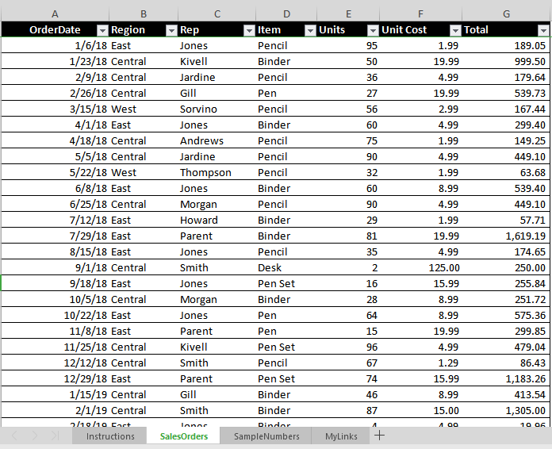
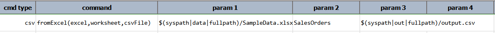
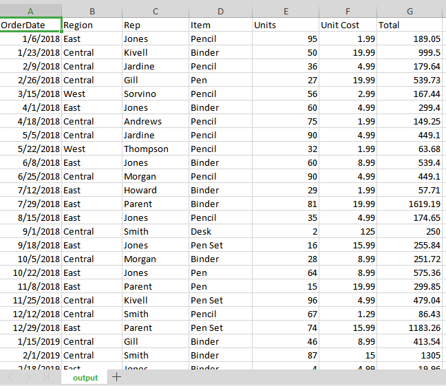

### Description
This command converts any `worksheet` of an `excel` file into a CSV file (denote `csvFile`). This is the new command 
name for the now-deprecated [`convertExcel(excel,worksheet,csvFile)`](convertExcel(excel,worksheet,csvFile)) command.

### Parameters
- **excel** - the Excel file to convert
- **worksheet** - name of the worksheet to convert
- **csvFile** - the destination CSV File. If exist, this file will be overwritten

### Example
Suppose we need the 'SalesOrders' worksheet from the SampleData.xlsx (below) in CSV format: 

**Script:** 

**output.csv** (displayed in Excel): 

### See Also
- [`toExcel(csvFile,excel,worksheet,startCell)`](toExcel(csvFile,excel,worksheet,startCell))
