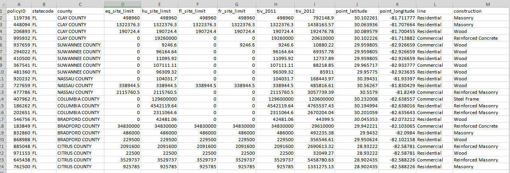
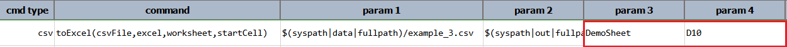
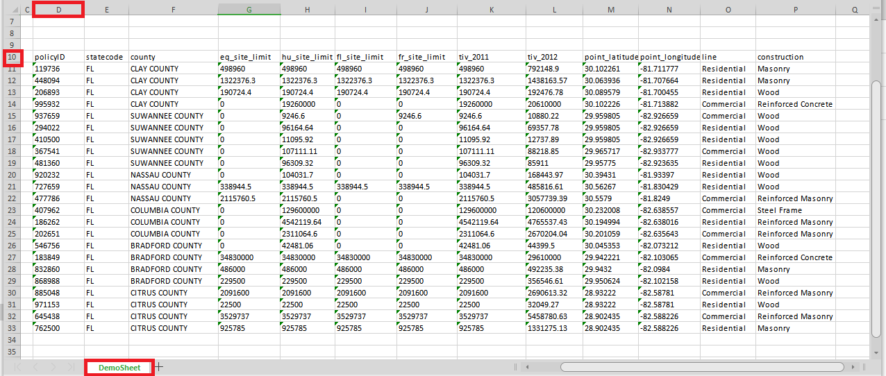

### Description
This command instruct Nexial to import the content of a CSV file (denote `csvFile`) into a `worksheet` of a `excel` 
file. Use the `startCell` parameter to specify the starting cell from which the CSV content will be imported. The 
cell format will be the same as the familiar Excel cell format - `COLUMN_LETTER`:`ROW_NUMBER`. For example, `A5`.

If the specified `excel` file doesn't exist, a new Excel file will be created. If the specified `worksheet` exists, its
content will be overridden by the specified CSV content.

### Parameters
- **csvFile** - the source CSV File from which to import
- **excel** - the destination Excel file
- **worksheet** - name of the destination worksheet
- **startCell** - starting cell address, such as `A1`, to import into

### Example
Suppose we want to import the following CSV - `example_3.csv` - to Excel: 

**Script** 
The script shows that we are import this CSV file to the "DemoSheet" worksheet, starting at position D10.

**Output : CountyDetails.xlsx** 

### See Also
- [`fromExcel(excel,worksheet,csvFile)`](fromExcel(excel,worksheet,csvFile))