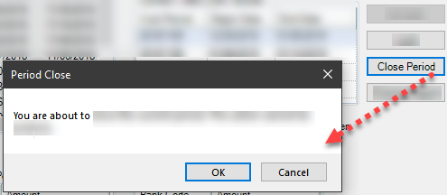

### Description
This command instructs Nexial to click on a button (denoted as `name`) on the current desktop application form, which is
scoped via the [`useForm(formName)`](useForm(formName)) command.

If no button cannot be associated with the specified `name` under current "form", the corresponding step will FAIL.

#### `nexial.desktop.simulateClick`
At times, the clicking of a button will consequently render a modal component (such as a warning dialog) and this might
cause the corresponding step to fail. For example,



To circumvent such issue, one may want to consider adding an "extra" automation hint to the target component, lke this:
```json
"My Button": {
    "type": "DesktopElement",
    "xpath": ".....",
    "controlType": "ControlType.Button",
    "name": "Lock",
    "automationId": ".....",
    "elementType": "Button",
    "label": "My Button",
    "extra": {
      "nexial.desktop.simulateClick": true
    }
}
```

The `nexial.desktop.simulateClick` key in the `extra` section instructs Nexial to use a "simulated" click rather than
generate a "real" mouse click event. The simulated click does not wait for the completion of rendering from the target
application and thus will not be blocked by the modal dialog that follows the button click. One would then be able to
interact with the modal dialog via the [`clearModalDialog(var,button)`](clearModalDialog(var,button)) command.

Note that `nexial.desktop.simulateClick` is also a System variable, which will have execution-wide impact. If both the
System variable and the "extra" configuration are found, the System variable will always take precedence.


### Parameters
- **name** - this parameter is the name of the button.


### Example


### See Also
- [`clickByLocator(locator)`](clickByLocator(locator))
- [`clickElementOffset(name,xOffset,yOffset)`](clickElementOffset(name,xOffset,yOffset))
- [`clickOffset(locator,xOffset,yOffset)`](clickOffset(locator,xOffset,yOffset))
- [`clearModalDialog(var,button)`](clearModalDialog(var,button))
