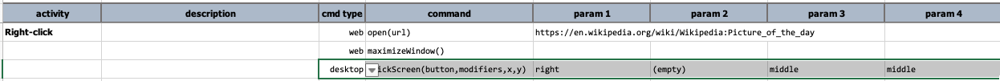
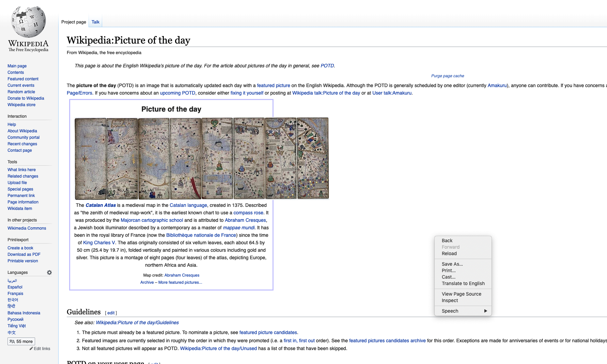

### Description
This command simulate the mouse-click event using OS-specific (_native_) mouse simulator. Such mouse-click event differs
from other "click" commands such as [web &raquo; `click(locator)`](../web/click(locator)) and 
[web &raquo; `clickOffset(locator,x,y)`](../web/clickOffset(locator,x,y)) in that this command uses native mouse 
simulator. The click event generated from the `web` commands are based on Selenium, which is generated through the
browser-specific WebDriver. However the click event generated via this command is not limited to browser or AUT. It is
thus possible to use this command to click anywhere on the current primary screen/monitor.

The possible value for `button` would be:
1. `left` -- For left-click. This is commonly the mouse button use for clicks.
2. `right` -- For right-click. This would usually trigger the display of context menu.
3. `middle` -- For middle-click.

Use the `modifiers` to add "control" keys as part of the click. Nexial will press down the specified keys while the 
intended click event is commencing, and release the same keys (in reverse order) when the click event is complete. 
The possible `modifiers` are:
- `{SHIFT}`
- `{CONTROL}`
- `{ALT}`
- `{COMMAND}` or `{CMD}`
- `{WIN}` or `{WINDOW}`
- `{COMMAND}` or `{CMD}`
- `(empty)` if no modifier key is needed.

For parameter `x`, it is possible to specify the x-position in pixel or use of the following:
- `middle` or `center` - the middle of the screen, lengthwise
- `left` - the left edge of the screen
- `right` - the right edge of the screen

For parameter `y`, it is possible to specify the y-position in pixel or use of the following:
- `middle` or `center` - the top of the screen, height-wise
- `top` - the top edge of the screen
- `bottom` - the bottom edge of the screen

### Parameters
- **locator** - the locator(xpath) of the target element
- **modifiers** - additional keys to press when perform the click. Use `{empty}` if no modifier is intended
- **x** - the X coordinate of the screen. This must not be greater than the width (pixel) of the current screen resolution
- **y** - the Y coordinate of the screen. This must not be greater than the height (pixel) of the current screen resolution

### Example
Right-click the middle of a web browser to bring up the context menu:

This result in the browser context menu being display:

### See Also
- [`clickButton(name)`](clickButton(name))
- [`clickByLocator(locator)`](clickByLocator(locator))
- [`clickElementOffset(name,xOffset,yOffset)`](clickElementOffset(name,xOffset,yOffset))
