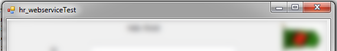
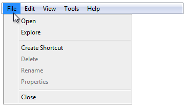
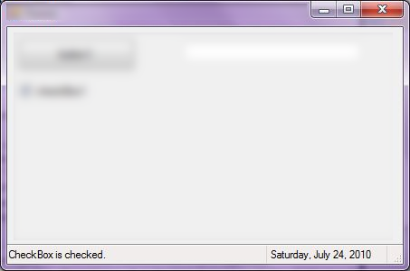
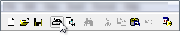
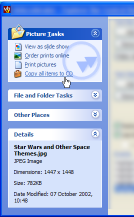
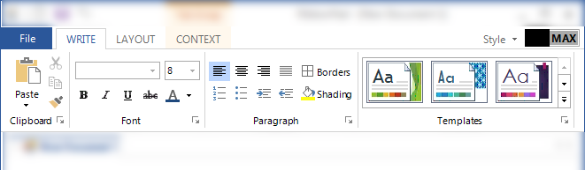
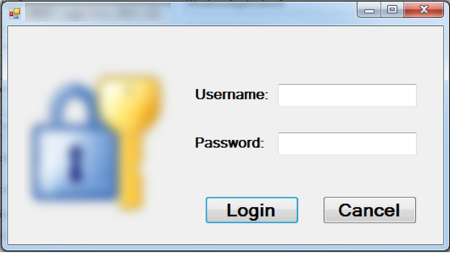

##
## Common Components
Most modern desktop applications come with a few common UI components. Here are some examples:

1. TitleBar 
    
2. MenuBar 
    
3. StatusBar 
    
4. ToolBar 
    

There are a few other less common components such as Ribbon and Explorer Bar:

5. ExplorerBar 
    
6. Ribbon 
    
7. LoginForm 
    

While Nexial supports all sorts of UI components, these common ones are treated slightly differently. For one, the
component properties gathered via "AutoScan" process are stored in a different file, as we'll see later.

 Some of these components, such as LoginForm or ExplorerBar are more unique to certain types of desktop applications. 
 
It turns out that there are a few built-in common components that Nexial supports inherently. These represents the common
UI components one frequently find with any modern desktop applications:
