## Introduction
Nexial's "desktop" commands are designed to automate the action or validation of desktop application (sorry, Windows 
only at this time!). It does so by utilizing <a href="https://github.com/2gis/Winium" class="external-link" 
target="_nexial_link">Winium</a> as its underlying automation engine to interact with the target Windows application. 
While it is not necessary to understand the inner workings of Winium, it might prove to be helpful to get an idea how
use of Winium impacted Nexial's approach and some of the nuances and limitation thereof.

One of the design decision is to use XPATH to reference UI components. Yes, it is possible to use other form of 
locators such as _Name_. But in our experience, XPATH proved to be the most comprehensive and reliable locators in 
this context. XPATH as the "format" for identifying UI components should not discourage anyone to consider using 
Nexial for desktop automation. As you will see later, Nexial is equipped with an "AutoScan" feature that matches UI 
component with an associated label, making the need to generate XPATH by hand more of an exception than norm. Should 
there be the need to work with XPATH, the nature of such task is relatively straightforward. In addition, Nexial is 
shipped with a few helpful tools to ease the learning process.


## 10,000 feet up
The process overview to desktop automation, ala Nexial, looks like this:
1. Create a `application.json` file as the main configuration file.
2. Configure the location and runtime parameters of the target application.
3. Configure the UI components of interests.
4. Create a Nexial script to invoke the target application. Nexial will "AutoScan" for UI components and generate 
   additional JSON files to store the UI component discovery.
5. Modify the generated JSON as needed.
6. Now we are ready for automation.

Let's look at each of these steps in more details.

** Note: It is also possible to automate without going through the aforementioned steps. However, one would need to 
   hand code the XPATH corresponding to each of the UI component of interests.

In case this might be of help, there are a few links to learn about JSON and XPath:
- <a href="http://www.w3schools.com/js/js_json_intro.asp" class="external-link" target="_nexial_target">http://www.w3schools.com/js/js_json_intro.asp</a>
- <a href="https://www.w3schools.com/xml/xpath_intro.asp" class="external-link" target="_nexial_target">https://www.w3schools.com/xml/xpath_intro.asp</a>


## application.json
In order for Nexial to provide "_smarts_" and convenience towards automation, we need to supply upfront some 
details regarding the application against which we want to automate. We do so via the `application.json`. This 
JSON file contains primarily two categories of information:
1. application under test (aut) - _Where is the application we want to automate, and how would we launch it?_
2. UI component - _What portions of the application are we targeted to automate?_

By default, this `application.json` is expected to be found in:

`<PROJECT>/artifact/data/desktop/<appId>/application.json`

The `app id` can be any text of your choosing as long as it is suitable as a directory and file name. This structure 
allow one to automate against multiple desktop applications. Each application is uniquely identifiable by its 
corresponding `app id` allow one to manage them independently.

The `application.json` has the general structure ([download it!](application.json)):

```json
{
    "aut": {
        "path"                          : "...",
        "exe"                           : "...",
        "args"                          : "...",
        "workingDirectory"              : "...",
        "dotnetConfig"                  : "...",
        "terminateExisting"             : false
    },

    "defaultWaitMs"                     : 800,
    "appStartupWaitMs"                  : 1000,

    "app": {
        "xpath"                         : "...",
        "components": {

            "Main Component 1": {
                "xpath"                 : "...",
                "components": {
                    "Sub Component 1a": {
                        "xpath"         : "..."
                    },
                    "Sub Component 2a": {
                        "xpath"         : "..."
                    }
                }
            },

            "Main Component 2": {
                "xpath"                 : "...",
                "components": {
                    "Sub Component 2a": {
                        "xpath"         : "..."
                    }
                }
            }
        }
    }
}
```

Let's break it down in the next section.  We will use the quintessential 
<a href="https://en.wikipedia.org/wiki/Microsoft_Notepad" class="external-link" target="_nexial_link">Notepad</a> 
application as our example.


### `"aut"`
The purpose of `"aut"` in `application.json` is to define the mechanics of invoking the target application:

|`"path"`             |The directory where the executable is found. Be sure to escape the backslash (i.e. `\\`). For example, `C:\\windows\\Systeme32`. |
|`"exe"`              |The executable file name. For example, `notepad.exe`                                            |
|`"args"`             |[optional] The command line arguments to be passed to the target executable.                    |
|`"workingDirectory"` |[optional] The directory from where the application should be launched. This is needed for application that could potentially behave differently based on where is launched. This is equivalent to specifying the "Start in" parameter for a Windows shortcut. For example:<br/><br/>Note that this directory must be read/write -able during execution.|
|`"dotnetConfig"`     |[optional] Only applicable to .NET application. Some .NET application is shipped with a corresponding `.config` file (XML), such as `MyApplication.exe.config`, which Nexial can use to extract application version and/or build number for reporting purpose.|
|`"terminateExisting"`|[optional] `true` if Nexial should terminate any running instances of the application during the invocation of [desktop &raquo; `(useApp(appId)`](useApp(appId)) (i.e. initialization) and terminate any running instance at the end of an execution. Default is `false`. |

<br/>
For Notepad, the `"aut"` section would something like this:
```json
{
	"aut": {
		"path": "C:\\windows\\system32",
		"exe": "notepad.exe",
		"terminateExisting": true
	}
}
```


### `"defaultWaitMs"`
The amount of time (in millisecond) to wait between desktop commands. This is separate from the standard 
[`nexial.delayBetweenStepsMs`](../../systemvars/index#nexial.delayBetweenStepsMs). Since it is not uncommon for desktop
automation to be slower than, say, API automation. Nexial separates these 2 types of wait. The `"defaultWaitMs"` here
is only applicable to desktop automation.


### `"appStartupWaitMs"`
The amount of time (in millisecond) to wait for the target application during start up (i.e. 
[desktop &raquo; `useApp(appId)`](useApp(appId))). If this is missing, the value of `"defaultWaitMs"` will be instead.


### `"app"`
This section contains the bulk of work to enable "AutoScan" and customization. Depending on the complexity of the 
application and the amount of customization needed, this section might require a fair bit of work and/or maintenance.

For each application, the corresponding `application.json` file would contain 1 `"app"` section and this section would
contain 1 or more components in its child `"components"` section. This child `"components"` section is a nested 
structure that may contain more component definitions. The general structure looks like this:

```json5
{
    ... ...

    "app": {
        "xpath"                         : "...",
        "components": {
            "component 1": {
                "xpath"                 : "...",
                "components": {
                    "component 1.1": {
                        "xpath"         : "...",
                        ... ...
                    },
                    ... ...
                }
            },
            ... ...
        }
    }
}
```

The `"xpath"` directly under `"app"` references the matching XPATH for the application window. To see how one can 
construct the XPATH with the help of Nexial-shipped UI Spy, click link below:

[Use UI Spy to help generate XPATH](uispy_xpath)

In the case of Notepad, this XPATH is:

    /*[@ClassName='Notepad' and @ControlType='ControlType.Window']

There are other configurations for `"app"` or its components, such as `xpathGenerationStrategy` and `label`, but we 
will address them later.

The `"components"` section (under `"app"`) is a nested structure to describe the UI component hierarchy is an application.
In the case of Notepad, there isn't any hierarchy. But in a slightly more complicated desktop application, like:


One can see that the ODBC Data Source Administrator dialog has another structure underneath it (`"data grid" "About the 
ODBC core components"`). And under that data grid structure, there are more UI components. To support such nested
component structure, one can nest the `"components"` under another `"components"` and so on. 

Back to Notepad, let's see what we can add under `"components"`.


#### `"components"`
Each UI component placed under the `"components"` section will look more or less like this:
```json5
"<COMPONENT_NAME>": {
    "xpath": "<XPATH FOR THIS COMPONENT>",
    
    "components": {
        "<ANOTHER_COMPONENT_NAME>": {
            "xpath": "<XPATH FOR THIS COMPONENT>",
            ... ...
        },
        ... ...
    }
},
... ...
```

Let's create 3 UI components for Notepad: the title bar, the status bar, the menu bar and the main area where text 
edit is done (aka "document"):

1. Title Bar<br/>
   UI Spy shows the following:<br/>
   <br/>
   Since the title bar is a component under the Notepad application window, the XPATH for it needs to include the XPATH
   for application window as well:

        /*[@ClassName='Notepad' and @ControlType='ControlType.Window']/*[@ControlType='ControlType.TitleBar' and @AutomationId='TitleBar']

2. Menu Bar<br/>
   UI Spy shows the following:<br/>
   <br/>
   Once again, XPATH of the parent component (the application window) must be included as well:

        /*[@ClassName='Notepad' and @ControlType='ControlType.Window']/*[@ControlType='ControlType.MenuBar' and @AutomationId='MenuBar']
        
3. "document" (where the text would go)<br/>
   UI Spy shows the following:<br/>
   <br/>
   Here's the XPATH for it:

        /*[@ClassName='Notepad' and @ControlType='ControlType.Window']/*[@ControlType='ControlType.Document']

The entire section of `"app"` now looks like this:
```json5
"app": {
    "xpath": "/*[@ClassName='Notepad' and @ControlType='ControlType.Window']",
    
    "components": {
        "TitleBar": {
            "xpath": "/*[@ClassName='Notepad' and @ControlType='ControlType.Window']/*[@ControlType='ControlType.TitleBar' and @AutomationId='TitleBar']"
        },
        
        "MenuBar": {
            "xpath": "/*[@ClassName='Notepad' and @ControlType='ControlType.Window']/*[@ControlType='ControlType.MenuBar' and @AutomationId='MenuBar']"
        },
        
        "document": {
            "xpath": "/*[@ClassName='Notepad' and @ControlType='ControlType.Window']/*[@ControlType='ControlType.Document']"
        }
    }
}
```

The "document" components is fairly straightforward. It has no UI components contained in it. The title bar contains 
only a few UI components, namely the "Minimize" button, the "Maximize" button and the "Close" button. But menu bar 
contains quite a few menu items. For example:


This would be quite an undertaking if one is required to hand code and maintain all the XPATH for each of these menu 
items.


## AutoScan
AutoScan to the rescue!

The main idea is to provide Nexial _just enough_ XPATHs to register the "container" components of an application so 
that Nexial can scan these containers and discover the enclosed UI components. What we have done so far (above) is
the "container" component registration. It is time for Nexial to do its work of scanning the child components, or 
sub-components, of these containers. To do so, we would invoke the [desktop &raquo; `useApp(appId)`](useApp(appId)) 
or the [desktop &raquo; `useForm(formName)`](useForm(formName)) command.

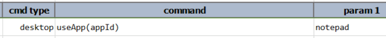<br/>
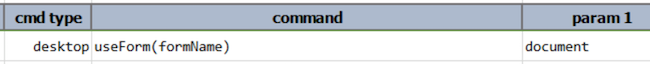<br/>

We will focus on [desktop &raquo; `useApp(appId)`](useApp(appId)) for now. 


### AutoScan via desktop &raquo; useApp(appId)
When this command is invoked, Nexial does the following:
1. Parse `<PROJECT>/artifact/data/desktop/<appId>/application.json`.
2. Find any "containers" registered under `"app"` &raquo; `"components"`.
3. For each container found, Nexial search for the corresponding JSON file under
   `<PROJECT>/artifact/data/desktop/<appId>/<appId>.<component name>.json`. [Common UI components](commonComponents) 
   will be stored in `<PROJECT>/artifact/data/desktop/<appId>/<appId>.commons.json`.
4. For each missing JSON file, Nexial initiate the AutoScan process to discover any UI components under the 
   corresponding container.
5. When the AutoScan process is complete, the corresponding JSON file is generated. Thus the AutoScan process would 
   have executed at most once (until such file is removed).

When the above command executes, Nexial will detect that the corresponding JSON file for `"TitleBar"`, `"MenuBar"` and
`"document"` are missing and the AutoScan process thus commence:

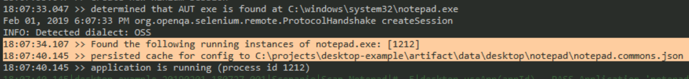

The 6-second time laps shown accounts for the AutoScan process. After this process is complete, we now see additional
JSON files being generated:

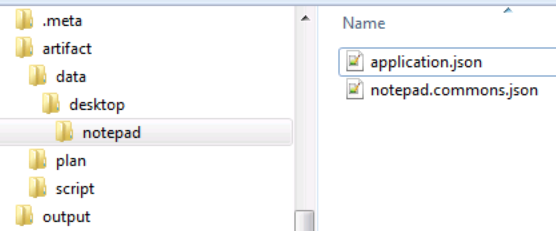

The `notepad.commons.json` contains the buttons (Minimize, Maximize, Close) 
on the title bar and the menu items for Notepad. Below is a graphical depiction of the UI components discovered via the 
AutoScan process (some details omitted for brevity):

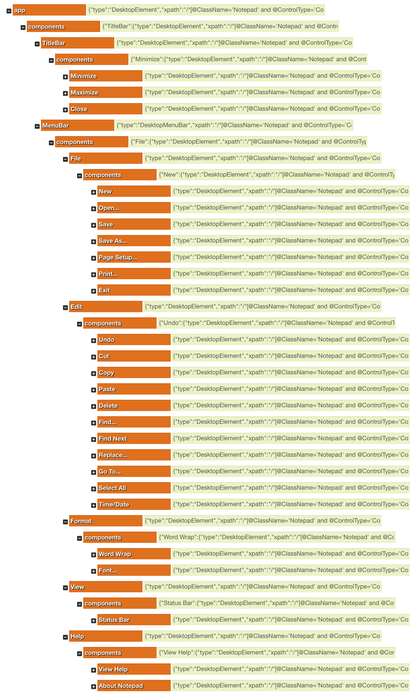<br/>
Courtesy of <a href="http://jsonmate.com/" class="external-link" target="_nexial_link">JSONmate</a>

A quick inspection of the generated JSON will reveal the amount of information discovered via the AutoScan process. From
the perspective of the automation engineer, most of these information are not directly relevant within a Nexial script.
The most important portion of this JSON is the identification and the associated label of these components. For example,

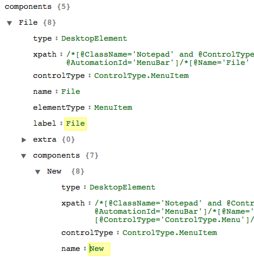

The highlighted labels - `File` and `New` - are what we will use in the Nexial script:

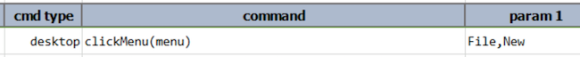

As a comparison, to perform the same automation via XPATH would be significantly more tedious:
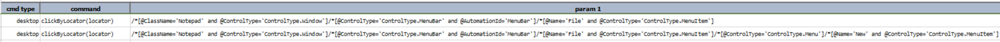


### AutoScan via desktop &raquo; useForm(formName)
The above showed the process of performing AutoScan on [common UI components](commonComponents) such as title bar and 
menu bar. Let's now look at how the AutoScan process looks like for other "container" components.

The purpose of [desktop &raquo; `useApp(appId)`](useApp(appId)) is to parse the corresponding `application.json` and all
registered components. As we saw in previous section, Nexial automatically scans for the common UI components when the
corresponding `<appId>.commons.json` is missing. Similarly when the corresponding JSON file for a "container" (or 
"form") is missing, Nexial likewise initiates the AutoScan process to discover the underlying UI components of such 
"container". Nexial uses the term "form" to refer to the UI component container.

For steps to automating a UI component are generally as follows:
1. Invoke [desktop &raquo; `useApp(appId)`](useApp(appId)) on the target application.
2. Invoke [desktop &raquo; `useForm(formName)`](useForm(formName)) on the target form (container) of the same 
   application.
3. Invoke one of the desktop command on a UI component of the same form. For example: 
   [desktop &raquo; `typeTextArea(name,text1)`](typeTextArea(name,text1,text2,text3,text4))

In the case of Notepad, there isn't any "form" to speak of. UI Spy shows that Notepad contains only 3 components - 
title bar, menu bar and "document" (where one types):


At step 2 (above), when Nexial determines that the corresponding JSON file (in this case, `notepad.document.json`) is 
missing, it performs AutoScan on the `"document"` "form". Since `"document"` does not contain any UI components, here is 
the generated `notepad.document.json` after [desktop &raquo; `useForm(formName)`](useForm(formName)) completes:

```json5
{
  "type": "DesktopElement",
  "xpath": "/*[@ClassName='Notepad' and @ControlType='ControlType.Window']/*[@ControlType='ControlType.Document']",
  "controlType": "ControlType.Document",
  "automationId": "15",
  "elementType": "TextArea",
  "label": "document",
  "extra": {},
  "components": {}
}
```

The `"components"` section is empty, indicating that no UI component was found within this `"document"` "form". This is 
where customization can help. We can self-reference the `"document"` as its own UI component by add the following to 
the "document" element:

```json5
{
  "type": "DesktopElement",
  "xpath": "/*[@ClassName='Notepad' and @ControlType='ControlType.Window']/*[@ControlType='ControlType.Document']",
  "controlType": "ControlType.Document",
  "automationId": "15",
  "elementType": "TextArea",
  "label": "document",
  "extra": {},
  "components": {
	"edit": {
		"type": "DesktopElement",
		"xpath": "/*[@ClassName='Notepad' and @ControlType='ControlType.Window']/*[@ControlType='ControlType.Document']",
		"controlType": "ControlType.Document",
		"automationId": "15",
		"elementType": "TextArea",
		"label": "edit",
	}
  }
}
```

Now it will appear to Nexial that `"app"` contains a `"document"` container (or form), and `"document"` contains a UI
component named `"edit"`. Even though the XPATH for `"edit"` and `"document"` are the same, Nexial will overlook this 
and allow the hierarchy customization. Now we can edit on the Notepad via the 
[desktop &raquo; `typeTextArea(name,text1,text2,text3,text4)`](typeTextArea(name,text1,text2,text3,text4)), like this:

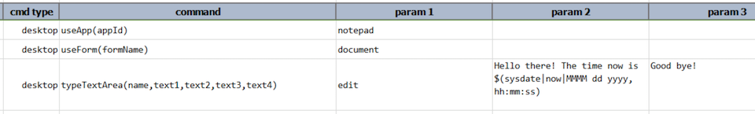

... which would yield the following effect to the target Notepad application.

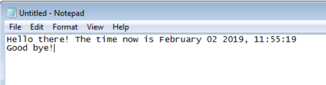

As a comparison, let's see another "form" that contains UI components. When saving a file in Notepad, the standard 
Windows "Save As" dialog is displayed for user can specify the target file and location:


With the help of UI Spy, we can derive the XPATH for this dialog as the following:

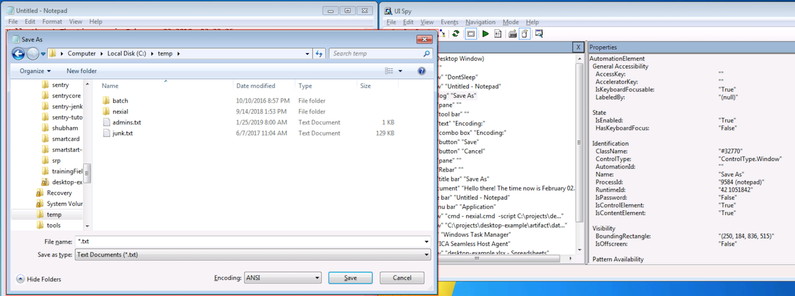

    /*[@ClassName='Notepad' and @ControlType='ControlType.Window']/*[@Name='Save As' and @ControlType='ControlType.Window']

We can give this "form" any name of our choosing (to improve readability). Here's one rendition:

```json5
{
  ... ...

  "app": {
    "xpath": "/*[@ClassName='Notepad' and @ControlType='ControlType.Window']",
    
    "components": {
      "TitleBar": {
        "xpath": "/*[@ClassName='Notepad' and @ControlType='ControlType.Window']/*[@ControlType='ControlType.TitleBar' and @AutomationId='TitleBar']"
      },
      
      "MenuBar": {
        "xpath": "/*[@ClassName='Notepad' and @ControlType='ControlType.Window']/*[@ControlType='ControlType.MenuBar' and @AutomationId='MenuBar']"
      },
      
      "document": {
        "xpath": "/*[@ClassName='Notepad' and @ControlType='ControlType.Window']/*[@ControlType='ControlType.Document']"
      },
      
      "save as": {
        "xpath": "/*[@ClassName='Notepad' and @ControlType='ControlType.Window']/*[@Name='Save As' and @ControlType='ControlType.Window']"
      }
    }
  }
}
```

The above shows a new "form" named `"save as"`. This is the "Save As" dialog. Since the corresponding 
`notepad.save as.json` has not yet being created, Nexial will activate AutoScan to discover the UI components in this 
dialog window. We will use the same [desktop &raquo; `useForm(formName)`](useForm(formName)) command to shift the focus
from `"document"` to `"save as"`:

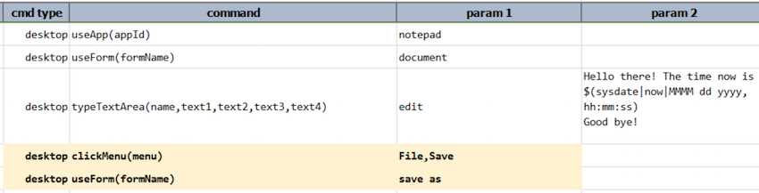

As before, the execution log shows the AutoScan process kicked in (and took about 6 seconds):

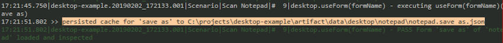

Here's a graphical depiction of the generated `notepad.save as.json` (edited for brevity) and how it mapped to the 
"Save As" dialog:

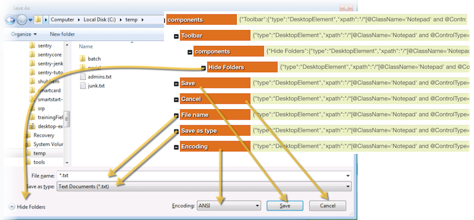

Now we can use the generated labels in our script, like this:

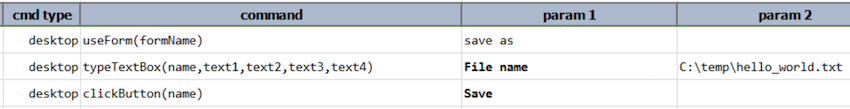

We can apply the same technique for other dialogs such as "Open", "Print Setup" and "Font".


### The benefit of AutoScan
1. **Auto-discovery of UI components** found within a "container" component. One can think of such container as a
   "form", a "pane" or a "section" that contains a related grouping of UI components. This reduce the need for 
   automation engineer to hand code the XPATH for each UI component.
2. **Stay current with UI development**. If a desktop application has gone through some UI changes, one can simply remove
   the corresponding JSON file to force re-scanning. Similarly, if new UI form or "container" is found, one can
   invoke a new AutoScan process by registering the XPATH for this new container.
3. **Progressive Scanning**. There is no need to register all the XPATHs upfront. As the need to automate arises, one
   can add new XPATH (and thus new one-time AutoScan process) on-the-fly.
4. **Readable automation script**. Possibly the biggest benefit of the AutoScan process is the omission for direct
   references to XPATH. Nexial provides mapping between the `"label"` to the corresponding `"xpath"` for each of the
   scanned UI component. Instead of automating via XPATH, one can simply reference the target UI component via its
   label, thus making the automation scripts readable and maintainable. Label helps to keep the automation script
   meaningful and relevant to everyone!
5. **Matching on-screen label and component**. We will see more about this later. Nexial, during the AutoScan process,
   applies multiple set of scan rules to match a label against a component on the application. While there is no way to
   do so 100% of the time, the matching logic has proved to be fairly reliable (more 90%). In addition, one can 
   customize the matching logic and the generated labels.
6. **UI Component Repository**. What AutoScan creates is a repository of UI components for a given application. For the 
   technical readers, this feature is loosely a realization of the 
   <a href="https://blog.cdemi.io/design-patterns-cache-aside-pattern/" class="external-link" target="_nexial_link">
   Cache-Aside Design Pattern</a>. The scanned UI components are stored in JSON (cache) hence future reference to the 
   same component would not require re-scanning. Furthermore these components are usable by multiple scripts within the
   same project. One can build up multiple repositories of applications and extend their use across the entire project.
   Such reuse speeds up script development and maintain consistency across the project.


There are a lot more content regarding Nexial's desktop automation and AutoScan process. Click on the links below to
learn more:
- [Common Desktop Components](commonComponents)
- [AutoScan via desktop &raquo; useForm(formName)](autoscanViaUseForm)
- [desktop JSON files for Notepad](jsonForNotepad)
- [desktop JSON files for Calc](jsonForCalc)
- [More configuration for component](componentConfiguration)

[Back to Desktop Commands](index)
