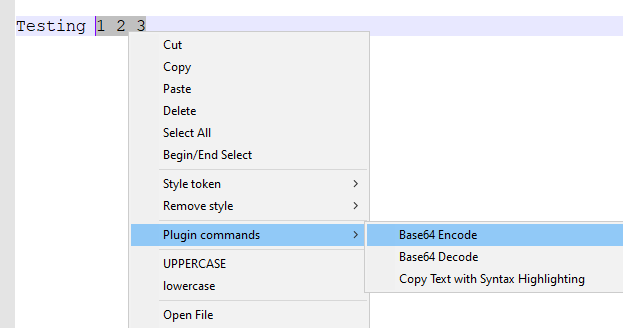

### Description
This command accesses the context menu (i.e. right-click) of a component named as `name`, and performs the 
invocation of such context menu via the specified `menu` parameter.

Note that Nexial does not verify if the target component can generate a context menu or not (for example, radio 
buttons generally do not generate context menu). Upon failure to locate any context menu, Nexial will exit the 
corresponding step with a **FAIL**.

Similarly, if the specified `menu` is incorrect, Nexial will exit the corresponding step with a **FAIL**.

For context menu with multiple levels of menu items, use comma (`,`) to separate each menu items. For example,
to access the "Base64 Encode" item under the "Plugin commands" menu (below), one would specify 
`Plugin commands,Base64 Encode` as the `menu` parameter.

Alternatively, one may reference the menu item via its position within its corresponding menu. Use the `INDEX:` prefix
to indicate position-based triggering. For example, to access the 3rd menu item from the context menu, follow by the 2nd
menu item from the submenu, the `menu` parameter would be `INDEX:3,2`.

As an additional convenience, one may include keystrokes whilst the context menu is in display. Use keystrokes as an
added support to expedite automation, when appropriate. For example, `{DOWN},INDEX:14,{CTRL}{SPACE},Execute` means:
1. When the context menu is first shown, press the DOWN key
2. Then select the 14th menu item
3. Then type in CONTROL-SPACE key combination
4. Finally, select the "Execute" menu item.

Consult the [`typeKeys(os,keystrokes)`](typeKeys(os,keystrokes)) page on how to specify keystrokes.

Both the `xOffset` and `yOffset` parameters are optional. One can use these 2 parameters to fine-tune where the
right-click should be invoked. By leaving both parameters as blank, Nexial will target the center (approximately) of the
specified element instead.

### Parameters
- **name** - the name of the component from which the context menu will be triggered.
- **menu** - the menu item(s) to invoked from the context menu.
- **xOffset** - the X coordinate of the element to be clicked on.
- **yOffset** - the Y coordinate of the element to be clicked on.

### Example

### See Also
- [`clickMenu(menu)`](clickMenu(menu))
- [`clickMenuByLocator(locator,menu)`](clickMenuByLocator(locator,menu))
- [`contextMenuByLocator(locator,menu)`](contextMenuByLocator(locator,menu,xOffset,yOffset))