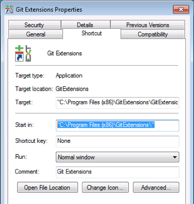

### Elements under 'aut' section

```json
{
    "aut": {
        "path": "",
        "exe": "",
        "args": "",
        "dotnetConfig": "",
        "terminateExisting": true,
        "workingDirectory": "",
        "runFromWorkingDirectory": true
    }
}
```


- **path:**

- The value for this key is to provide the full path of the application under test.
- e.g C:\\\windows\\\system32

- **exe:**

- The value for this key is to provide the application name under test with proper extension
- e.g calc.exe,notepad.exe

- **args:**

- The value for this key is to provide if any specific argument required for application under Test.
- This is an optional key and can be skipped if application does not require argument.
- If any program which requires specific argument then value need to be passed to this key.
    
- **dotnetConfig:**

- The value for this key is to provide the .NET configuration required for the application under test. The .NET configuration file is usually named as \[application_executable\].exe.config.
- This key is optional, and is only used to retrieve the built version information in order to reference a specific build of the AUT.
- If this is key is provided, the output file will be generated within the current version number of the app.

- **terminateExisting:**

- This key determines if Nexial should terminate any existing instance of AUT before starting the test automation.
- At times, it is useful to keep the same instance of AUT running (therefore set **terminatingExisting** to **false**) in order to run a possibly long test script midway.
- At times, however, it is necessary to (re)start AUT each time when the test script runs (therefore set **terminatingExisting** to **true**) - esp. when running as part of CI/CD.
- The default is **false**.

- **workingDirectory:**

- It is optional
- Specify the "current" directory for the AUT executable. This is equivalent to setting the "Start in" parameter for a Windows shortcut, like below:



By setting this configuration, the specified AUT executable will treat this directory as its "working" directory. Note that this directory must be read/write -enabled for the user id that executes the test script.

- **runFromWorkingDirectory:**
- It is optional
- Determine if the specified executable should be launched from **workingDirectory**.
- Some applications are designed such as to run only from its own directory. As such, one must specify **workingDirectory** and set **runFromWorkingDirectory** as **true**.
- The default is **false**.

### Examples
Below are few examples of capturing Keys under aut components of desktop Application.

**Notepad.exe**

```json
{
     "aut": {
     "path": "C:\\windows\\system32",
     "exe": "notepad.exe",
     "args": "",
     "dotnetConfig": "",
     "terminateExisting": true
    }
}
```

**calc.exe**
```json
{
     "aut": {
     "path": "C:\\windows\\system32",
     "exe": "calc.exe",
     "args": "",
     "dotnetConfig": "",
     "terminateExisting": true
     }
 }
```
