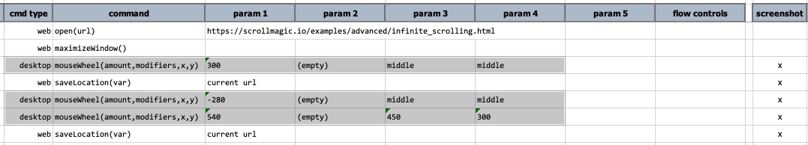

### Description

**CURRENTLY ONLY WORKS ON WINDOWS**

This command instructs Nexial to simulate mouse wheel movement on screen at a position specified via `x` and `y`. The 
amount of "wheel notch" is determined by `amount`, which is expected as an integer. Negative integer would represent 
"backward" notch (meaning moving backward).

Use the `modifiers` to add "control" keys as part of the click. Nexial will press down the specified keys while the 
intended mouse event is in progress, and release the same keys (in reverse order) when the mouse event is complete. 
The possible `modifiers` are:
- `{SHIFT}`
- `{CONTROL}`
- `{ALT}`
- `{COMMAND}` or `{CMD}`
- `{WIN}` or `{WINDOW}`
- `{COMMAND}` or `{CMD}`
- `(empty)` if no modifier key is needed.

For parameter `x`, it is possible to specify the x-position in pixel or use of the following:
- `middle` or `center` - the middle of the screen, lengthwise
- `left` - the left edge of the screen
- `right` - the right edge of the screen

For parameter `y`, it is possible to specify the y-position in pixel or use of the following:
- `middle` or `center` - the top of the screen, height-wise
- `top` - the top edge of the screen
- `bottom` - the bottom edge of the screen

We are researching on how to achieve the same on MacOSX. _Stay tuned!_

### Parameters
- **amount** - the amount of "wheel notch" to simulate.
- **modifiers** - the locator(xpath) of the target element.
- **x** - the X coordinate of the element to be clicked on.
- **y** - the Y coordinate of the element to be clicked on.

### Example

### See Also
