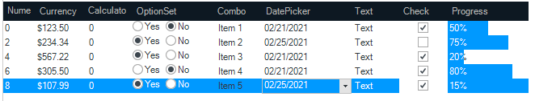
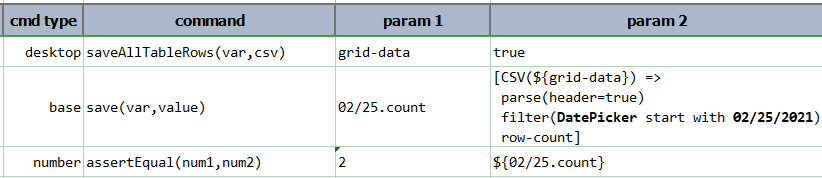
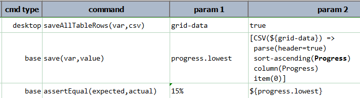
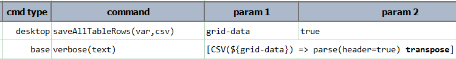
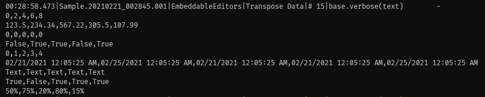

### Description
This command instructs Nexial to save all data of the [current table](useTable(var,name).md) into `var` for offline 
(and often, faster) data processing. All the captured data will be treated as text; no data type conversion or 
formatting will be performed.

Note that this command will work only after the [`useTable(name)`](useTable(var,name)) has been invoked.

Optionally, one can set the last parameter `csv` to `true` to obtain the same data set as a CSV structure. Note that
this CSV structure will include column header as well. Often converting grid data to CSV is preferred as one would be
able to utilize the various CSV-related facilities within Nexial for additional automation. For example:

1. Determine the number of rows where "DatePicker" equals to "02/25/2021": 
   
2. Sort the column "Progress" and assert that "15%" is the lowest of such value:
   
3. Transpose the grid data so that its rows and columns are interchanged:
    
    
    
As of [v3.7](../../release/nexial-core-v3.7.changelog), this command supports also "HierTable" (as a "table"). One may 
use this command for both the traditional "data grid" component as well as the hierachical/collapsible "TreeView" grid.

### Parameters
- **var** - this parameter will store the table row value into variable
- **csv** - `true` if data should be converted into CSV structure

### Example
See above

### See Also
- [`saveRowCount(var)`](saveRowCount(var))
- [`saveTableRows(var,contains,csv)`](saveTableRows(var,contains,csv))
- [`saveTableRowsRange(var,beginRow,endRow,csv)`](saveTableRowsRange(var,beginRow,endRow,csv))
- [`useHierTable(var,name)`](useHierTable(var,name))
- [`useTable(var,name)`](useTable(var,name))
