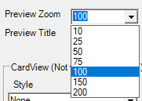
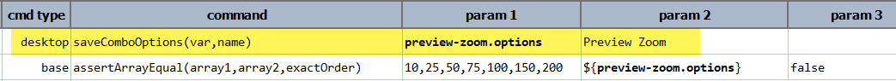

### Description
This command instructs Nexial to collect the list of options associated with the specified ComboBox component (denote 
as `name`) and saving the text value of these options as a list into the data variable denoted as `var`. Note that if
the specific component is not a ComboBox or is not enabled, the corresponding step will be considered as FAIL. 
Furthermore, if there is no options associated with the specified ComboBox component, then the specified data variable (
as denoted by `var`) will be removed as well.

### Parameters
- **var** - the variable where the options are stored.
- **name** - the name of the target ComboBox element.

### Example
Suppose we have the following ComboBox:

We can write our script like this:

### See Also
- [`clearCombo(name)`](clearCombo(name))
- [`saveComboOptionsByLocator(var,locator)`](saveComboOptionsByLocator(var,locator))
- [`selectCombo(name,text)`](selectCombo(name,text))
