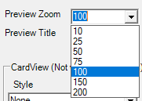

### Description
This command instructs Nexial to collect the list of options associated with a ComboBox component associated with the 
specified `locator`, and saving the text value of these options as a list into the data variable denoted as `var`. Note 
that if the specific component is not a ComboBox or is not enabled, the corresponding step will be considered as FAIL.
If there are more than 1 ComboBox component matching to the specified `locator` then only the first ComboBox will be
considered. Furthermore, if there is no options associated with the specified ComboBox component, then the specified 
data variable ( as denoted by `var`) will be removed as well.

### Parameters
- **var** - the variable where the options are stored.
- **locator** - the locator for the target ComboBox element.

### Example
Suppose we have the following ComboBox:

We can write our script like this:

### See Also
- [`clearCombo(name)`](clearCombo(name))
- [`saveComboOptions(var,name)`](saveComboOptions(var,name))
- [`selectCombo(name,text)`](selectCombo(name,text))
