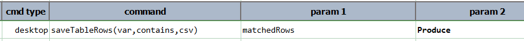
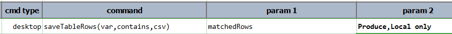

### Description
This command instructs Nexial to save rows of data from the [current table](useTable(var,name).md) into `var` for 
offline (and often, faster) data processing. All the captured data will be treated as text; no data type conversion or 
formatting will be performed. Use the `contains` parameter to indicate which row(s) from the current table to capture. 
Only rows with a column that matches the value specified in the `contains` parameter will be captured. One may specify 
multiple values (separated by [`nexial.textDelim`](../../systemvars/index#nexial.textDelim) to narrow the filtering 
criteria. For example:

Capture the rows which has at least 1 column that matches to "Produce": 

Capture the rows which has at least 1 column that matches to "Produce" and at least 1 column that matches to "Local only":

Note that this command will work only after the [`useTable(name)`](useTable(var,name)) has been invoked.

Optionally, one can set the last parameter `csv` to `true` to obtain the same data set as a CSV structure. Note that
this CSV structure will include column header as well. Often converting grid data to CSV is preferred as one would be
able to utilize the various CSV-related facilities within Nexial for additional automation. See 
[`saveAllTableRows(var,csv)`](saveAllTableRows(var,csv)) for examples.

This command supports PolyMatcher, which provides greater flexibility and expressiveness in data filter:



As of [v3.7](../../release/nexial-core-v3.7.changelog), this command supports also "HierTable" (as a "table"). One may 
use this command for both the traditional "data grid" component as well as the hierachical/collapsible "TreeView" grid.

### Parameters
- **var** - this parameter will store the table row value into variable
- **contains** - Limit the rows to capture via this parameter
- **csv** - `true` if data should be converted into CSV structure

### Example
See above

### See Also
- [`saveAllTableRows(var,csv)`](saveAllTableRows(var,csv))
- [`saveRowCount(var)`](saveRowCount(var))
- [`saveTableRowsRange(var,beginRow,endRow,csv)`](saveTableRowsRange(var,beginRow,endRow,csv))
- [`useHierTable(var,name)`](useHierTable(var,name))
- [`useTable(var,name)`](useTable(var,name))
