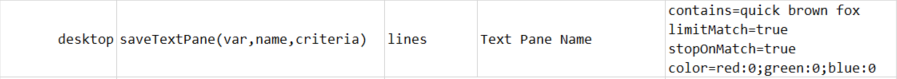

### Description

This command is designated for a very specific type of desktop component, which within the Nexial context is dubbed as the `TextPane`.  It's not easy to find such desktop component and perhaps even more difficult to recognize them.  Here's an example:

Such component looks and behaves almost like a `List`, except for one differentiating characteristics - its content and inner elements are not accessible!  If you try to inspect such component from UISpy (or similar tool), the tool will show no child element nor content for it.  It is unlikely you would not encounter such desktop component unless your AUT was developed many years ago (before the inception of .NET, e.g.).  

In any case, this command is designed to assist you in the interaction with such legacy component.  In particular, one can specify a series of matching criteria and Nexial will gather all the matching rows and save them as a variable of your choosing.

For criteria, here are the possible options:

- **`stopOnMatch`** - if `true`, Nexial will stop further scanning upon the first match.  Use this to improve speed, and when you only want to the first row that matches your criteria.
- **`contains`** - search for the row with text that contains `contains`. **`regex` ALWAYS TAKES PRECEDENCE**, so `contains` is disabled when '`regex`' is specified.
- **`limitMatch`** - if `true`, then only match the characters specified in `contains`. **APPLICABLE ONLY WHEN 'contains' IS SPECIFIED**. Use this to improve speed, but only when the exact text is not important.
- **`regex`** - specify the regex to match by; takes precedence over "contains" match.
- **`stopOnEmptyText`** - if `true`, Nexial will stop further scanning when a blank/empty row is found.  Recommend to always set this criteria as true unless finding all the empty rows in a `TextPane` is important. 
- **`limitRows`** - specified the rows (zero-based) to consider for matching - e.g. `limitRows=0,1,2,3,11,12`. When used, all unspecified rows will be skipped.  Use this to improve speed.
- **`color`** - specified the color as a criteria to match. Used in the form of `red=[0-255],green=[0-255],blue=[0-255]`.  For example, `color=red:255` means match on **RED** text, `color=red:255;green:255` means match on **YELLOW** text. To say **BLACK**, specify `color=red:0;green:0;blue:0`.

### Parameters
- **var** - The variable name to use when storing the match result on the target `TextPane` component
- **name** - The name (or label) of the `TextPane` component
- **criteria** - The criteria to use when matching against the text content of the target `TextPane` 

### Example
**Script**: 
`criteria` to select first matched row that `contains` text in `color` red  
 

`criteria` to select first matched row that `contains` same text in `color` black  
 

If no color is specified, selects the first matched row irrespective of any color.

### See Also
- [`clickTextPane(name,criteria)`](clickTextPane(name,criteria))
- [`clickTextPaneRow(var,index)`](clickTextPaneRow(var,index))
- [`saveText(var,name)`](saveText(var,name))
- [`saveTextByLocator(var,locator)`](saveTextByLocator(var,locator))
