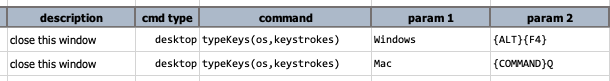
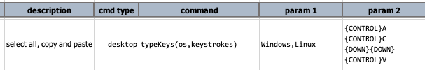

### Description
This command instructs Nexial to automate a series of `keystrokes` to the current execution environment. Multiple
`keystrokes` may be specified in multiple lines (optional). Since there isn't an universal standard for key input 
(different keyboards, key mapping, etc.), this command uses the `os` parameter to limit its execution to the matching
operating system(s). For example,

The first command indicates that `{ALT}{F4}` is only supported on Windows and hence will only execute on a Windows 
operating system. The second command is designated for Mac OSX and will only run when the current execution is running
on a Mac operating system.

The supported operating systems are (case-insensitive):
- `Windows`
- `Mac` or `MacOSX`
- `Linux`
- `*` (special case: specified keystrokes supported by all OS)

Use [`nexial.textDelim`](../../systemvars/index#nexial.textDelim) to indicate the support for multiple operating 
systems. For example the following means that these `keystrokes` are supported by Linux and Windows:

The command supports all common PC-104 and Mac keyboard keys. Modifiers and function keys are enclosed within `{...}` 
(see below). Regular keys can be expressed as is. 

##### Modifiers
- `{SHIFT}`
- `{CONTROL}`
- `{ALT}`
- `{WINDOWS}` (for PC-104 keyboard only)
- `{CONTEXT}` (for PC-104 keyboard only)
- `{COMMAND}` or `{META}` (for Mac keyboard only)

##### Function keys
- `{ESCAPE}` or `{ESC}`
- `{F1}` through `{F12}`
- `{PRINTSCREEN}` or `{PRNTSCN}` (for PC-104 keyboard only)
- `{SCROLL_LOCK}` (for PC-104 keyboard only)
- `{PAUSE}` (for PC-104 only)
- `{BACKSPACE}` or `{BKSP}`
- `{INSERT}`
- `{DELETE}` or `{DEL}`
- `{NUMLOCK}` (for PC-104 keyboard only)
- `{TAB}`
- `{CAPSLOCK}`
- `{SPACE}`
- `{ENTER}`

##### Directional keys
- `{HOME}`, `{END}`, `{PAGEUP}`, `{PAGEDOWN}`, `{UP}`, `{DOWN}`, `{LEFT}`, `{RIGHT}`

### Caution
This command do not check or make any effort that AUT is currently present or in display in the foreground. It simply
issues the specified keystrokes in the order provided without any regard to how the system or application might
react to them. Hence it is critical to design one's automation such that the intended application/window is 
appropriately positioned as the active/foreground window **PRIOR** to executing this command.

The issue of each keystroke (or combination of modifiers and a key) will additionally incur roughly 100 ms. Hence if
additional time is needed to account for the intended reaction from the target application, it might be best to break
up into multiple commands with [base &raquo; `waitFor(waitMs)`](../base/waitFor(waitMs)) commands between them.



### Parameters
- **os** - the operating system(s) that will support the specified keystrokes. Unmatched OS will omit such execution.
- **keystrokes** - the keys to issue upon the current operating system. Longer keystrokes can be broken down to 
multiple lines.
      

### Example
See above

### See Also
- [`typeTextBox(name,text1,text2,text3,text4)`](typeTextBox(name,text1,text2,text3,text4))
- [`sendKeysToTextBox(name,text1,text2,text3,text4)`](sendKeysToTextBox(name,text1,text2,text3,text4))