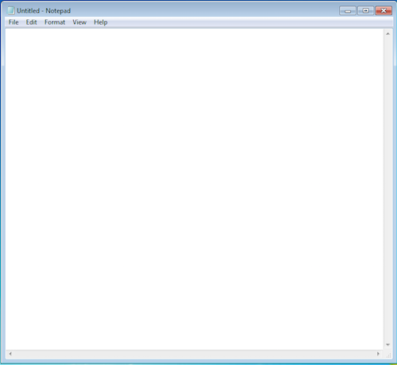

### Create XPATH
Nexial is shipped with a free tool from Microsoft called UI Spy. You can find this tool under 
`$NEXIAL_HOME/bin/windows/UISpy.exe`. This tool expose some of the internal application properties to help creating 
the XPATH we need for desktop automation.

As an example, we will use Microsoft Notepad as the target application:

Let's see how UI Spy can help to figure out the XPATH for the application window (of Notepad):
1. Open the target application (in our case, Notepad).
2. Open UI Spy by double-clicking on `$NEXIAL_HOME/bin/windows/UISpy.exe`.
3. From UI Spy, click on the "Highlight Rectangle" icon (the 6th from the left) and "Hovering Mode" icon (the 2nd last 
   from the right): 
   
4. Now UI Spy is ready to "spy" on our application. Hover your cursor over the Notepad application window **WHILE** 
   pressing down the `Ctrl` key. You should see a red rectangle highlighted over the application window:
   
5. Notice on the right side of UI Spy the internal properties of our target application window (Notepad). These 
   properties will help us to generate the appropriate XPATH.
6. We can use the same technique to work on other XPATHs (for other UI components). More on this later.

Here's the "Properties" view for Notepad:

This means we can generate a XPATH by including the highlighted information, like this:

    /*[@ClassName='Notepad' and @ControlType='ControlType.Window']

In case you are new to XPATH, the XPATH above reads:
> "Find a component of any type (`/*`) that has an attribute called "ClassName" (`@ClassName`) with the value `Notepad` 
> **and** another attribute called "ControlType" (`@ControlType`) with the value of `ControlType.Window`".

Applying the same technique, one can generate the XPATH for the "area on Notepad where you can type". The screenshot
below shows the UI components that are under the main application window:

The "document" component is the UI component of interest. Clicking on it reveals the internal properties of this 
component:

In the same way as we did for the application window, we can derive at the XPATH for the "document" component as:

    /*[@ClassName='Notepad' and @ControlType='ControlType.Window']/*[@ControlType='ControlType.Document']

The XPATH above reads:
> "Find a component of any type (`/*`) that has an attribute called "ClassName" (`@ClassName`) with the value `Notepad` 
> **and** another attribute called "ControlType" (`@ControlType`) with the value of `ControlType.Window`". Then, find
> underneath such component another component that has an attribute called `ControlType` with the value of 
> `ControlType.Document`.

This XPATH is longer because we needed to describe the fully qualified path to the "document" component. The more
technical savvy readers will quickly point the use of `//*` to forego the hierarchical reference, like this:

    //*[@ControlType='ControlType.Document']

The `//*` means any component at any level. While the above technically could work, it is not practical. One can see 
from UI Spy that there many UI components (desktop applications) on the Windows desktop at any given point in time. The
time needed to find a UI component of "any type, at any object hierarchical level" is simply too time consuming.

By using the technique described above we can uncover and derive the XPATH of almost all the UI components we 
encountered. There are a few exceptions to this, and we'll discuss about this at a later time.

### Mind Your Path
A few things to note:
1. It is not necessary to use all the attributes found in the Properties pane (of UI Spy). Almost always, the ones to 
   consider should only be limited to `ClassName`, `ControlType`, `AutomationId` and `Name`. Other attributes are often 
   irrelevant or dynamic (unreliable).
2. It is not necessary to use as many attributes as available. The key to create a XPATH that consistently and uniquely 
   identify the target component.
3. Since Nexial relies on Winium, which in turn utilizes <a href="https://en.wikipedia.org/wiki/Microsoft_UI_Automation" 
   class="external-link" target="_nexial_link">Microsoft UI Automation (UIA)</a> for UI automation, we are limited to
   <a href="https://en.wikipedia.org/wiki/XPath#Syntax_and_semantics_(XPath_1.0)" class="external-link" 
   target="_nexial_link">XPATH 1.0</a>. The expressiveness and capabilities of XPATH 1.0 is certainly much less than 
   those of XPATH 2 or 3. MUIA's implementation of XPATH is considered by some to be slightly under par than that of 
   the XPATH 1.0 standards.
4. UI Spy does **NOT** generate XPATHs. But it provides useful information from which we can use to create XPATH by
   hand.

