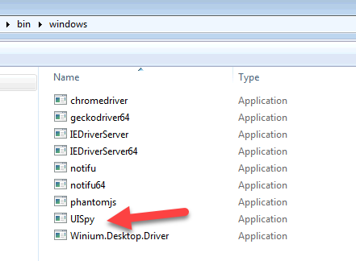
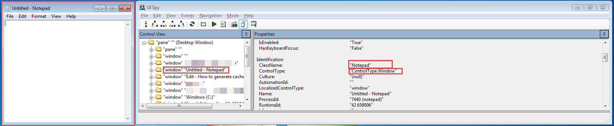
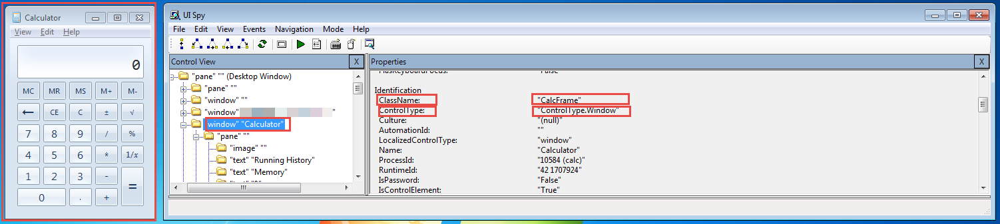

### XPath creating strategy using UISpy
The Element was identified by attribute 'ClassName' having value as 'CalcFrame' and having attribute ControlType with value as 'ControlType.Window'
The value was assigned to defined key xpath under app component.

- If there is attribute **AutomationId** available for the element then it is always recommended to use that attribute.
- The values of the attribute **AutomationId** are very constant and does not changed very often.

**Capturing and Mapping of Xpath for Common Static Components**

- This is optional, and would only be needed if it is applicable to your target application.
- This section will also explain about different keys and configuration related to app common component which are common and static UI components
- This section explains capturing xpath and mapping to customized names as per your application for those common components
- The components names should be your customized names like in below e.g these are user defined name TitleBar, StatusBar, Ribbon, ExplorerBar which are eventually called in the script by that name.

**Xpath Mapping for each Individual Component**

- This section explains capturing xpath and mapping to customized names as per your application for different UI Screen Components.
- This section explains how to write xpath expression for all different forms and UI screens of the application.
- This is very crucial in helping nexial to scan and create json for the each form with all the elements correctly identified.

**Identifying object in UISPy and capturing Xpath**

- Download open source tool **UISPY** and it can be used in identifying the windows application elements.
- UISPY cane be can be found in your downloaded zip file, under "bin/windows" folder.

**How to use and Identify the Element**

- This section explains high level explanation of capturing windows element and attribute using UISPY.
- Below if the e.g for capturing the element for login screen

- Notepad.exe

  

**Explanation to create Xpath for the above screen would be as below.**

The Element was identified by attribute 'ClassName' having value as 'Notepad' and having attribute ControlType with value as 'ControlType.Window'
The value was assigned to defined key xpath under app component.

**Calc.exe**

  

**Explanation to create Xpath for the above screen would be as below.**

