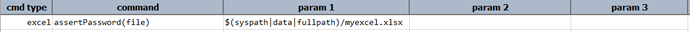
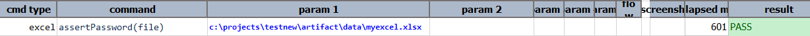

### Description
This command asserts if the password is set to specified excel file.

### Parameters
- **file** - the Excel file to assert

### Example
**Script**:

**Output**: 

### See Also
- [`setPassword(file,password)`](setPassword(file,password))
- [`clearPassword(file,password)`](clearPassword(file,password))
