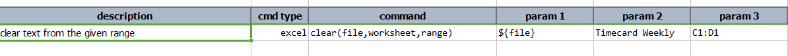
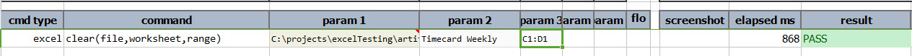

### Description
This command clears the text from the cells in the given `worksheet` from an excel `file` in the given range. 
A "special" range value of `*` will instruct Nexial to remove the target `worksheet` and recreate it.

### Parameters
- **file** - the Excel file to clear
- **worksheet** - name of the worksheet to clear
- **range** - range of cells to clear

### Example
**Script**:

**Output**: 

### See Also
- [`write(file,worksheet,startCell,var)`](write(file,worksheet,startCell,data))
- [`read(file,worksheet,range,var)`](read(file,worksheet,range,var))
