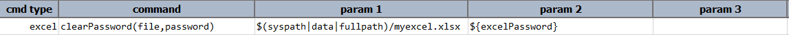
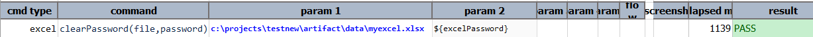

### Description
This command clears the password that was set to specified Excel file.

### Parameters
- **file** - Excel file to clear password
- **password** - password that to be cleared

### Example
**Script**:

**Output**: 

### See Also
- [`setPassword(file,password)`](setPassword(file,password))
- [`assertPassword(file)`](assertPassword(file))
