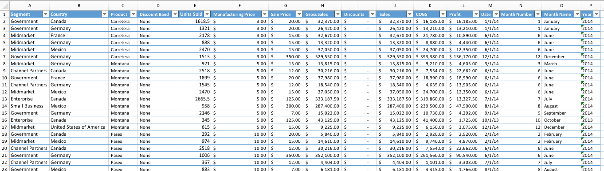
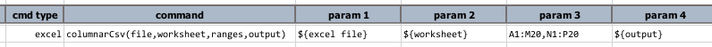
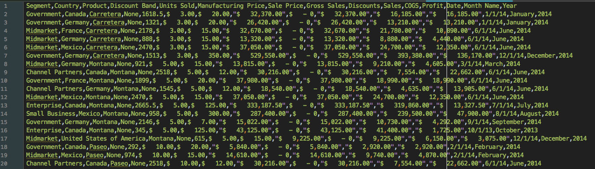
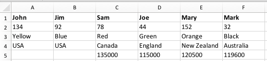

### Description
This command transforms one or more Excel ranges into a CSV file via combining each subsequent range as new columns to
the previous range. For example, suppose we have the following Excel worksheet:



Then a command like this (note `param 3` specifies 2 ranges - `A1:M20,N1:P20`):<br/>
<br/>

... would yield the following CSV file:<br/>
<br/>

For better visualization, we can import the CSV file into a visual tool:<br/>
<br/>

Via this command, we can capture 2 separate ranges (adjacent, disconnected or overlapped) and combined them into one CSV
file. Unlike [`csv(file,worksheet,range,output)`](csv(file,worksheet,range,output)), which append ranges as "rows",
this command combines ranges as new columns.  The example above shows that the first range `A1:M20` is merged with the
second range `N1:P20` as adjacent columns, effectively eliminated Column `O` (Month Number).

This command supports such form of merge over multiple ranges of the same worksheet. These ranges may be adjacent, 
disconnected or overlapped to each other. In addition, it will attempt to compensate for the missing columns, should 
latter ranges exceed the former ranges in terms of rows.  For example,

<br/>

Supposed the specified `ranges` are `A1:C4,E1:F5`. Clearly the first range (`A1:C4`) has less rows than the second 
(`E1:F5`). In such case, this command will fill in the missing cells for the first range with empty values, like this:

```csv
John,Jim,Sam,Mary,Mark
123,92,78,154,32
Yellow,Blue,Red,Orange,Black
USA,USA,Canada,New Zealand,Australia
,,,120500,119600
```

Notice the last row with the successive commas (`,`). Nexial compensate the uneven rows via empty values so that the
eventual output retains the expected CSV format and the range values remain aligned to their associated columns.

This command will only read from the same `worksheet`.


### Parameters
- **file** - The excel file to read from.
- **worksheet** - The worksheet to read from.
- **ranges** - The ranges to read from.  The ranges can be adjacent, disconnected or overlapped from each other.
- **output** - The CSV output to write to (as CSV format). 


### Example
See above


### See Also
- [`csv(file,worksheet,range,output)`](csv(file,worksheet,range,output))
- [`[EXCEL(...) => csv()]`](../../expressions/EXCELexpression#csv)
- [`[EXCEL(...) => csvWithHeader()]`](../../expressions/EXCELexpression#csvwithheader)
