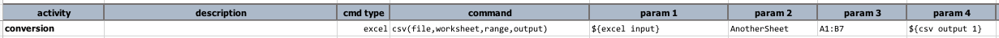
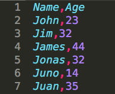

### Description
This command transforms a contiguous cell `range` (could be ranges, see below) from a Excel `worksheet` to a 
CSV file (`output`). The `file` parameter represents the Excel file to read from.

The `range` parameter can either represent one contiguous range, such as `A1:M40` (contiguous from cell A1 through 
cell M40), or a set of disconnected or overlapped ranges, such as `A1:M40,C52:X71,A84:D92` (disconnected ranges) or 
`A1:F10,B4:G6` (overlapped ranges). The separator between ranges is determined by 
[`nexial.textDelim`](../../systemvars/index#nexial.textDelim).

Note that if the specified `file` or `worksheet` does not exists, an empty CSV file will be generated.

### Parameters
- **file** - The excel file to read from.
- **worksheet** - The worksheet to read from.
- **range** - The range or ranges to read from.
- **output** - The CSV output to write to (as CSV format). 

### Example
**Script**: 

The Excel worksheet in question is as follows: 

The **output** CSV file look something like this: 

### See Also
- [`json(file,worksheet,range,header,output)`](json(file,worksheet,range,header,output))
- [`[EXCEL(...) => csv()]`](../../expressions/EXCELexpression#csv)
- [`[EXCEL(...) => csvWithHeader()]`](../../expressions/EXCELexpression#csvwithheader)
- [`[EXCEL(...) => json(firstRowAsHeader)]`](../../expressions/EXCELexpression#jsonfirstrowasheader)
