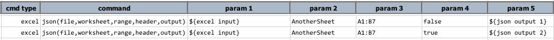
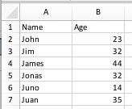
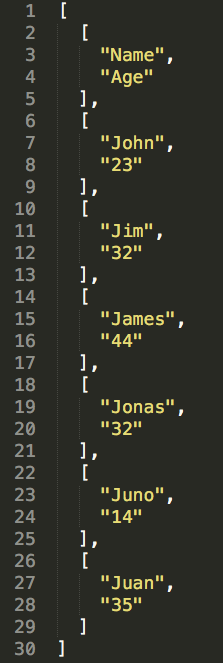
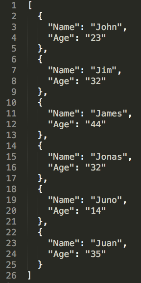

### Description
This command transform a contiguous cell `range` from a Excel `worksheet` to a JSON `output` file. The `file` parameter
represents the Excel file to read from. One may specify `header` as `true` or `false`, which will impact the structure
of the output JSON:
- `header`=`true`: output structure will be a JSON array with one or more JSON object containing name/value pair(s), 
  each representing one cell in the specified Excel cell range. The first row of the specified Excel cell range will be
  used as the "name" of the JSON nodes.
- `header`=`false`: output structure will be a JSON array with one or more JSON array, each containing one or more text
  node to represent the cells of each specified Excel row. The first row will be output in the same manner as all rows.

### Parameters
- **file** - The excel file to read from.
- **worksheet** - The worksheet to read from.
- **range** - The range to read from.
- **header** - `true` if the first row of the specified Excel cell range should be considered as header, `false` if the
  first row should be treated the same way as all other rows.
- **output** - The JSON output to write to (as JSON array). 

### Example
**Script**: 

The Excel worksheet in question is as follows: 

The **output** JSON file, without and with header, look something like these: 
 &nbsp;&nbsp;&nbsp;&nbsp;&nbsp; 

### See Also
- [`csv(file,worksheet,range,output)`](csv(file,worksheet,range,output))
- [`[EXCEL(...) => csv()]`](../../expressions/EXCELexpression#csv)
- [`[EXCEL(...) => csvWithHeader()]`](../../expressions/EXCELexpression#csvwithheader)
- [`[EXCEL(...) => json(firstRowAsHeader)]`](../../expressions/EXCELexpression#jsonfirstrowasheader)
