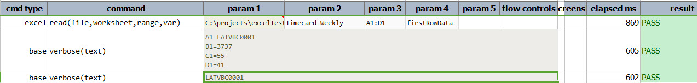

### Description
This command reads the data from the cells of the given worksheet from the excel file with the given range 
and will be saved in the given variable.

### Parameters
- **file** - the Excel file to read from
- **worksheet** - name of the worksheet to read from
- **range** - range of cells to read from, separated by **:**
- **var** - variable name to store the cell values read from specified `file`, `worksheet` and `range`.

### Example
**Script**: 

**Output**: 

### See Also
- [`write(file,worksheet,startCell,var)`](write(file,worksheet,startCell,data))