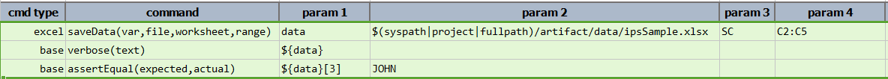

### Description
This command reads the data from the excel worksheet with the given cell range and save the data into 
variable.  The data is stored as a list, where its individual item can be retrieved via the corresponding index 
(0-based), as shown in the example.

### Parameters
- **var** - this parameter is used to save the returned value
- **file** -  this parameter is the source file path
- **worksheet** - this parameter is the name of the excel sheet
- **range** - this parameter is the range of the cells from which data is to be read. Cell range is to be given
  in the common Excel address format of **`<Start Cell>:<End Cell>`**.

### Example
**Script**: 

**Output**: 

### See Also
- [`saveRange(var,file,worksheet,range)`](saveRange(var,file,worksheet,range))
