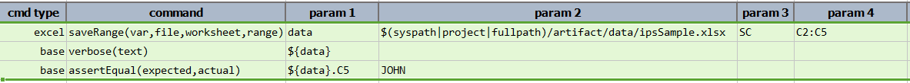
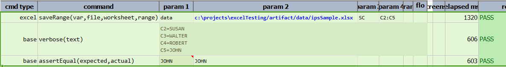

### Description
This command saves a range of the cell data from an Excel worksheet.  The cell range is expected in the
common Excel address format of **`<Start Cell>:<End Cell>`**.

### Parameters
- **var** - this parameter is used to save the cell range value
- **file** -  this parameter is the source file path
- **worksheet** - this parameter is the name of the excel sheet
- **range** - this parameter is the range of the cells from which data is to be read. Cell range is to be given 
  in the common Excel address format of **`<Start Cell>:<End Cell>`**.

### Example
**Script**: 

**Output**: 

### See Also
- [`saveData(var,file,worksheet,range)`](saveData(var,file,worksheet,range))
