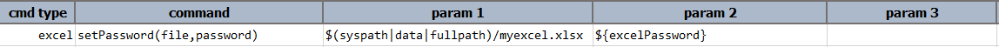
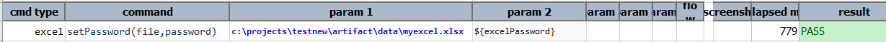

### Description
This command sets the password to specified Excel file.

### Parameters
- **file** - Excel file to which password is to set
- **password** - password that is to set

### Example
**Script**:

**Output**: 

### See Also
- [`clearPassword(file,password)`](clearPassword(file,password))
- [`assertPassword(file)`](assertPassword(file))
