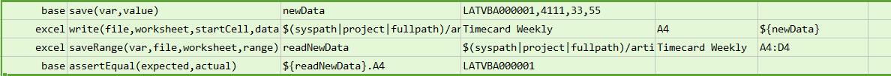
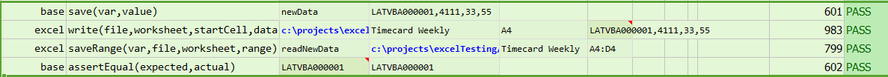

### Description
This command writes a set of data to a specified Excel `worksheet`, starting from the specified `startCell`.
The `data` is expected to 
- The data values need to be entered in number of cells should be in a string format with 'comma' separated.
- Each value is entered in the cell and the next value will be entered into next cell.

### Parameters
- **file** - the Excel file to write to
- **worksheet** - the name of the worksheet to write to
- **startCell** - the starting cell to write
- **data** - data values to write to the specified Excel `file`, `worksheet`.  Multiple values are separated by 
  [`$(nexial.textDelim)`](../../systemvars/index#nexial.textDelim) and multiple lines separated by `\n`.

### Example
**Script**: 

**Output**: 

### See Also
- [`writeAcross(file,worksheet,startCell,array)`](writeAcross(file,worksheet,startCell,array))
- [`writeDown(file,worksheet,startCell,array)`](writeDown(file,worksheet,startCell,array))
- [`writeVar(var,file,worksheet,startCell)`](writeVar(var,file,worksheet,startCell))
