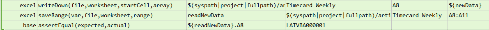
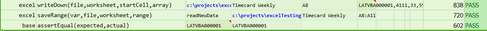

### Description
This command writes a list of data in the excel `worksheet` down the column from the given cell reference denoted by 
`startCell`.

### Parameters
- **file** - the Excel file to write to
- **worksheet** - the name of the worksheet to write to
- **startCell** - the starting cell to write
- **array** - list of data values to write to the specified Excel `file`, `worksheet`.  Multiple values are separated by 
  [`$(nexial.textDelim)`](../../systemvars/index#nexial.textDelim).

### Example
**Script**: 

**Output**: 

### See Also
- [`write(file,worksheet,startCell,data)`](write(file,worksheet,startCell,data))
- [`writeAcross(file,worksheet,startCell,array)`](writeAcross(file,worksheet,startCell,array))
- [`writeVar(var,file,worksheet,startCell)`](writeVar(var,file,worksheet,startCell))
