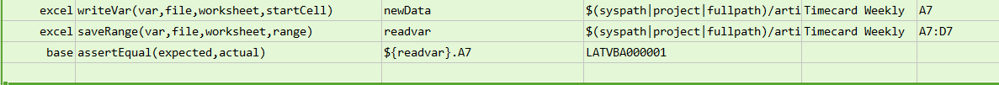
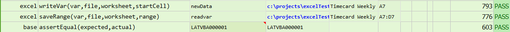

### Description
This command writes the data in `var` to the excel `worksheet`.  The data in `var` may represent multiple cells and 
rows.  Rows are separated by `\n` and cells are separated by `${nexial.textDelim}`.

### Parameters
- **var** - the variable which contains the data
- **file** - the Excel file to write to
- **worksheet** - the name of the worksheet to write to
- **startCell** - the starting cell to write

### Example
**Script**: 

**Output**: 

### See Also
- [`write(file,worksheet,startCell,data)`](write(file,worksheet,startCell,data))
- [`writeAcross(file,worksheet,startCell,array)`](writeAcross(file,worksheet,startCell,array))
- [`writeDown(file,worksheet,startCell,array)`](writeDown(file,worksheet,startCell,array))
