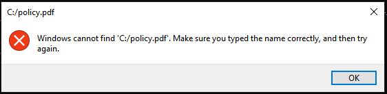

### Description
This command is used to open any type of file like pdf, excel, txt, image etc. This command will instruct the OS to open the file, if the
specified file is not found, OS will show alert message.

### Parameters
- **filePath** - this parameter is the path along with the name of the file to be open

### Example 1
**Script**: 

If the file does not exist at the specified path the OS will show alert message.

### See Also
[external &raquo; `runProgram(programPathAndParams)`](runProgram(programPathAndParams))
