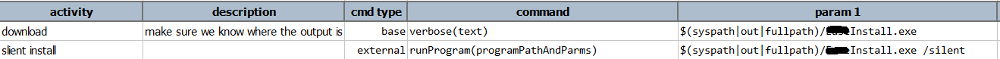
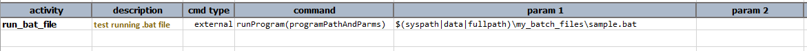
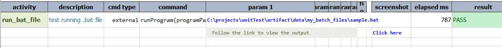
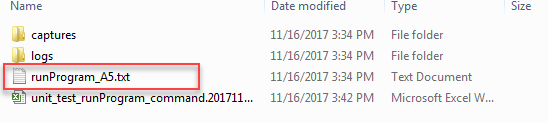

### Description
This command is to execute the desired program or script, which is expected to be available on the test harness. If the
specified program or script is not found, this command will consider such condition as **FAIL**.

One can consider using this command as a technique to incorporate existing tests that are developed via a different
toolset or to update target application via silent installation.  The standard output of the specified program or
script will be saved to the output directory, and made available on the output file. This output file can be derived 
via [`nexial.external.output`](../../systemvars/index#nexial.external.output) System variable. The same output
file - which will be a combination of standard out and standard error - will be made available as a link in the 
output file as well (see screenshot in the Example section below).

Nexial supports the execution of parameterized commands over sub-shell (`cmd.exe` for Windows, `sh` or `bash` for 
*NIX and MacOSX) via the use of single quotes. For example:

```
/bin/bash -c '~/tools/AwesomeTool*/bin/MyTool.sh param1 param2 param3'
```

By using the `'...'` syntax, Nexial will pass the parameterized command wrapped within the single quotes to the 
sub-shell (in this case, `bin/bash`) to interpret. The `bash` program will in turn expand its input and then execute it 
within its command space. This provides the capability to expand out `~/tools/AwesomeTool*/bin/MyTool.sh` to its 
proper/physical path before executing it. This is a great way to execute commands where its exact location cannot be 
determined at the time of automation.


### Parameters
- **programPathAndParams** - this parameter is the path along with the name of the exe file to be launched


### Example 1
**Script**:<br/>



### Example 2
Running a sample.bat file.

Just provide the file path as an argument. And also has the option to pass arguments for that program along with the 
path.


**Output**:<br/>


The standard output from this program is saved in the output file, that can be found in the corresponding project 
output folder.



### See Also
[external &raquo; `runProgramNoWait(programPathAndParams)`](runProgramNoWait(programPathAndParams))
