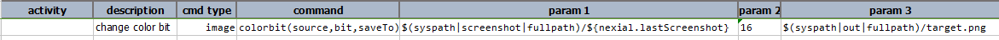
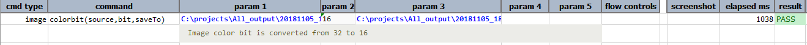

### Description
This command changes color bit of the specified image to a specified color bit. This command modifies color bit only if 
current image bit is more than target bit specified via `bit`.

Nexial supports `image` as URL (instead of fully qualified path). Nexial will automatically download image content and 
save it to temporary location (System/OS -specific). Use `saveTo` to determine the location of the processed file.

  
### Parameters
- **source** - full path of the image file to convert color bit. 
- **bit** - one of the supported bit (the target bit to convert into): `32`, `16`, `8`, `4`, `2` or `1`.
- **saveTo** - the full path of the target (converted) image

### Example
Script: 

Output: 

Following are images after downgrading colorbit:-

|Original Image (24 bit) |8 bit|
|------------------------|-----|
|||

|4 bit |2 bit|
|------|-----|
|||

### See Also
- [`convert(source,format,saveTo)`](convert(source,format,saveTo))
