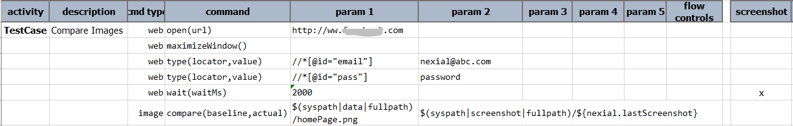
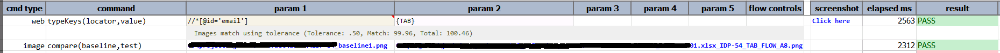
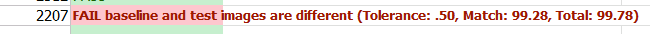

**DEPRECATED - USE [`saveDiff(var,baseline,actual)`](saveDiff(var,baseline,actual)) INSTEAD.**

### Description
This command compares 2 images (`baseline` and `actual`). If the two images are different, the difference is highlighted 
(as rectangular borders) in a new image saved to the output folder. A link will be provided to this "diff" image in the 
corresponding screenshot column as `comparison` and this associated step marked as FAIL.

Color for highlighting difference can be modified via [`nexial.imageDiffColor`](../../systemvars/index#nexial.imageDiffColor).

The comparison uses [`nexial.imageTolerance`](../../systemvars/index#nexial.imageTolerance) as variance.

### Parameters
- **baseline** - the full path of the expected image to compare.
- **actual** - the full path of the actual image file to compare.

### Example
Here's an example of comparing a captured screenshot against a predefined baseline image: 

See [`nexial.lastScreenshot`](../../systemvars/index#nexial.lastScreenshot) for more details on this system variable.

**Output**: 

If there are errors, the result will reflect the violation against the defined tolerance: 

#### See Also
- [saveDiff(var,baseline,actual)](saveDiff(var,baseline,actual))