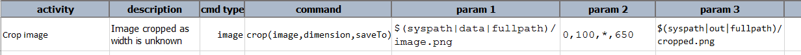
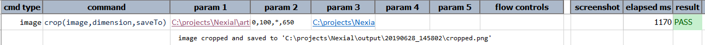
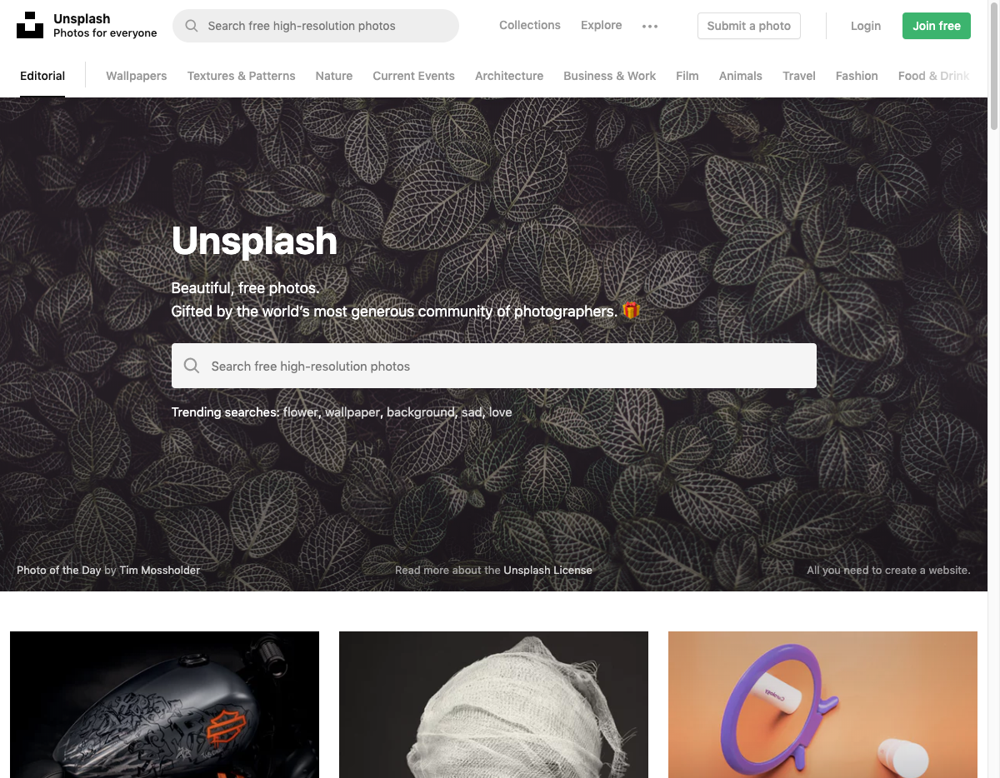
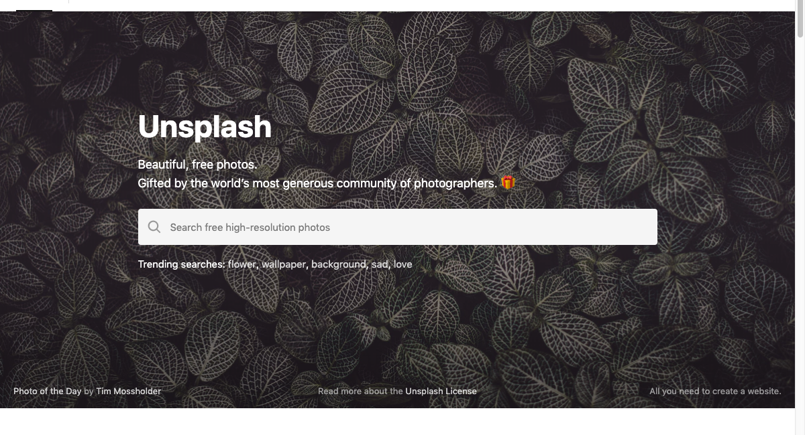

### Description
This command crops an image, whose location is denoted by `image`, and save it to another location denoted as 
`saveTo`. The parameter dimension represents the starting position (a.k.a. the x/y point), the width and the height to 
crop. These 4 values are separated by [`nexial.textDelim`](../../systemvars/index#nexial.textDelim). They must be 
positive integers and must be represent an area within the bounds of the `image`.

Nexial supports the use of `*` (asterisks) in place of width and/or height, if width or height of image is unknown or 
if the intention is to crop "as much as possible".

Following are the ways to represent dimensions assuming [`nexial.textDelim`](../../systemvars/index#nexial.textDelim) 
is comma (`,`):
1. `10,10,100,200` - crop image from position (10,10) for a width of 100 pixel and a height of 200 pixel.
2. `10,10,100,*` - crop image from position (10,10) for a width of 100 pixel until bottom of the image (height - 10). 
3. `10,10,*,200` - crop image with starting point as (10,10) for a height of 200 pixel until the right side of the 
   image (width - 10).
4. `10,10,*,*` - crop image from position (10,10) for the remaining width and height of the image (width - 10, 
   height -1 0). 

Nexial supports `image` as URL (instead of fully qualified path). Nexial will automatically download image content and 
save it to temporary location (System/OS -specific). Use `saveTo` to determine the location of the processed file.

### Parameters
- **image** - the full path of the image to crop
- **dimension** - the x position, y position, width in pixel, and height in pixel of the intended crop area. 
  These values are separated by [`nexial.textDelim`](../../systemvars/index#nexial.textDelim).
- **saveTo** - the full path of the cropped image

### Example
Script: 

Output: 

**Original Image**: 

 

**Cropped Image**: 

 

### See Also
- [`resize(image,width,height,saveTo)`](resize(image,width,height,saveTo))
