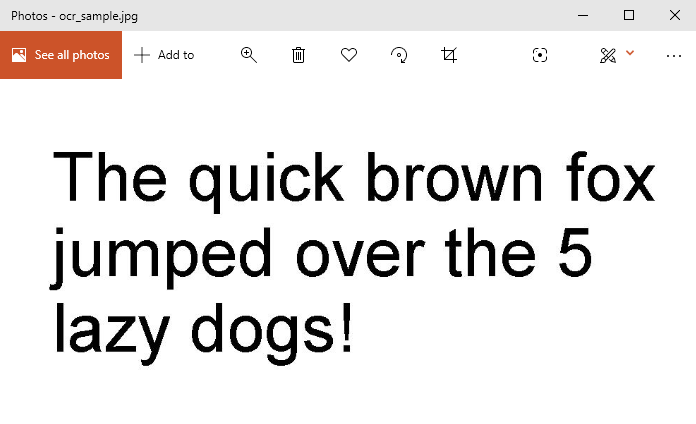
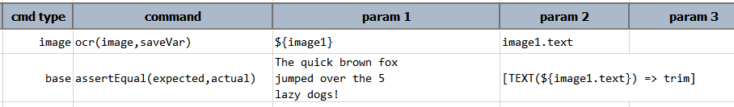

### Description
This command performs OCR (optical character recognition) on a specified image (`image`) and then saving the 
recognized text to a data variable denoted as `saveVar`. Note that Nexial is utilizing an external API for the OCR 
process, which is, by some standard, a fairly basic implementation. It works best on images that contains mostly text 
formed by block fonts (such as Arial, Verdana, Courier, Times New Romans, etc.). Handwritten text are less likely to be 
recognized correctly. In addition, images with complex format or nested table structure will less likely be recognized 
correctly.

Note that as of [Release 3.5](../../release/nexial-core-v3.5.changelog), this command also supports PDF files. Simply
specify a PDF file for the `image` parameter to activate OCR for PDF file. Note that at this time, this command will 
only support a PDF file with 3 pages or less.

This command supports the following image formats:
1. JPEG (file extension `.jpg` or `.jpeg`)
2. PNG (file extension `.png`)
3. GIF (file extension `.gif`)
4. TIFF (file extension `.tif` or `.tiff`)
5. Bitmap Images (file extension `.bmp`)
6. PDF (file extension `.pdf`, as of Release 3.5)

For images containing pre-formatted section like table, Nexial will try to retain existing layout. However it will not 
be able to retain successive blank spaces or tabs.

This command is best use to detect key words or key phrases, such as names, addresses, status. title, etc. For text 
formatting, alignment, font sizes or color, this command will not be able to provide sufficiently towards such ends.

For more advance text scraping automation, consider using 
[vision &raquo; `saveText(profile,image,var)`](../aws.vision/saveText(profile,image,var)). It uses 
<a href="https://aws.amazon.com/rekognition/" class="external_link" target="_nexial_target">AWS' Rekognition</a>, 
which is paid service.

### Parameters
- **image** - the full path of the image/pdf to scan
- **saveVar** - the data variable to store the OCR text

### Example
Suppose we have the following image: 

We can extract text from this image with something like this: 
**Script**: 

### See Also
- [vision &raquo; `saveText(profile,image,var)`](../aws.vision/saveText(profile,image,var))
