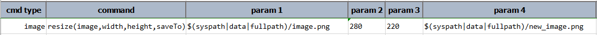
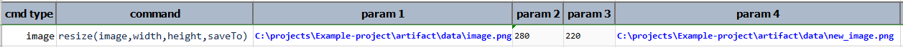

### Description
This command resizes an image, with full path denoted by `image`, to another size as denoted by `width` and `height` 
and saves it to another file denoted by `saveTo`. Both `width`and `height` must be positive integers and may be 
greater than the original `image` (enlarge).

Nexial supports `image` as URL (instead of fully qualified path). Nexial will automatically download image content and 
save it to temporary location (OS-specific). Use `saveTo` to determine the location of the processed file.

### Parameters
- **image** - the full path of the image to resize
- **width** - the width to resize to. Use `*` to keep current image width.
- **height** - the height to resize to. Use `*` to keep current image height.
- **saveTo** - the full path of the resized image.

### Example
**Script**: 

**Output**: 

**Original Image**: 

**Resized Image**: 

 

### See Also
- [`crop(image,dimension,saveTo)`](crop(image,dimension,saveTo))
