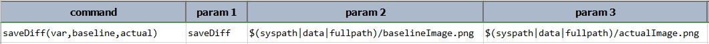
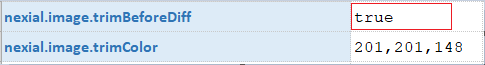
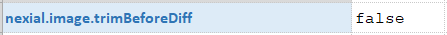
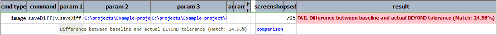
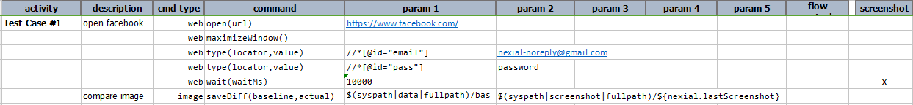
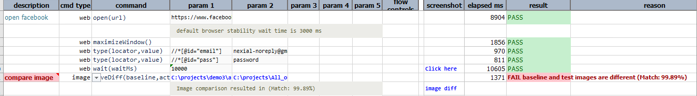
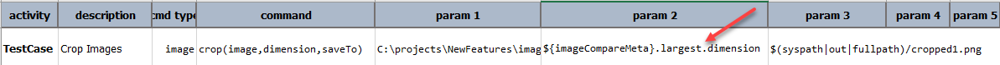

### Description
This command compares 2 images - `baseline` and `actual` -and store the image comparison metadata in the variable 
specified as `var`. Nexial supports both `baseline` and `actual` as URL (instead of fully qualified path). In such case, 
Nexial will automatically download image content and save it to [`TEMP`](../../systemvars/index#java.io.tmpdir) 
directory (OS-specific) prior to image comparison.

If the two images are different, the differences are highlighted (as rectangular borders) in a new image saved to the 
output folder. A link will be provided to this "diff" image in the corresponding screenshot column as `comparison` and 
the corresponding step will be marked as FAIL. If [`nexial.outputToCloud`](../../systemvars/index#nexial.outputToCloud) 
is set to `true`, the "diff" image will be saved to the cloud.

Color for highlighting difference can be modified via the 
[`nexial.imageDiffColor`](../../systemvars/index#nexial.imageDiffColor) System variable.

The image comparison uses [`nexial.imageTolerance`](../../systemvars/index#nexial.imageTolerance) as variance. One can
modify this System variable to adjust the passing criteria of the corresponding step. For example, `0` means the images
must be **exactly** the same; `20` means the images can differ up to 20%.

At times the 2 images to compare might different by some innocuous "blank" padding, such the case when capturing web 
content via different browsers. As these "blank" padding will be surfaces as image differences. However, in some cases 
they ought to be treated as "noise" since they do not represent difference in the image "content". Nexial offers a 
simple approach to remove such "noise" by trimming them off prior to image comparison. To do so, set the 
[`nexial.image.trimBeforeDiff`](../../systemvars/index#nexial.image.trimBeforeDiff) System variable to `true`. One can
control what color to trim off via the [`nexial.image.trimColor`](../../systemvars/index#nexial.image.trimColor) System
variable. Example of image trimming using `nexial.image.trimBeforeDiff` system variable is as follows: 

  |Baseline Image            |Actual Image               |
  |------------------------  |--------------------------|
  |||
  
  Dimensions of baseline image is `373x49` and actual image is `289x29`. For comparing Baseline and actual image noise 
  must be trimmed, and in the above example background of Citron color() acts as a noise. RGB color code of Citron is 
  `201,201,148` which must be trimmed from all four sides.
  <br/> 
  **Script**:<br/>
  
  
  **Output of both Pass and Fail condition of this command:** 
  <div class="tabs" style="width:140%">
      <ul class="tab-links tabs-collapsed">
          <li class="active" ><a href="#tab1"> nexial.image.trimBeforeDiff = true</a></li>
          <li ><a href="#tab2"> nexial.image.trimBeforeDiff = false</a></li>   
      </ul>
      <div class="tab-content"> 
          <div id="tab1" class="tab">
          This will trim off spaces of the color mentioned in the <code>nexial.image.trimColor.</code><br/> 
               <b>Data file:</b><br/>
               <br/>
               <b>Output:</b><br/>
               <br/>  
          </div> 
          <div id="tab2" class="tab" style= "display:none;">
                <b>Data file:</b><br/>
                <br/>
                <b>Output:</b><br/>
                <br/>
          </div> 
      </div>
  </div><br/>
  
#### Working with Image Comparison Meta
As stated earlier, comparison metadata is stored to variable specified as `var`. Following are the metadata fields:
1. **expected**: the file path of predefined `baseline` image.
2. **actual**: the file path of `actual` image.
3. **matchPercent**:r the matched percentage of two images.
4. **tolerance**: tolerance to be needed during comparing images.
5. **count**: count of differences of the image
6. **differences**: list of differences in the image.
7. **smallest**: smallest difference in the image.
8. **largest**: largest difference in the image.
9. **trimmed**: image is trimmed before comparison then it returns `true` else `false`.

The difference mentioned here is the area where the difference between `baseline` and `actual` is detected. Here is an 
example of such metadata:

```text
{
    {
        expected    = C:\projects\NewFeatures\image-compare\artifact\data\CompareImages1.png,
        actual      = C:\projects\NewFeatures\image-compare\artifact\data\CompareImages2.png,
        matchPercent= 97.55,
        tolerance   = 0.0,
        count       = 2,
        smallest    = { x=1020, y=25, width=37, height=13, },
        largest     = { x=65, y=11, width=409, height=39, },
        differences =[
            { x=65, y=11, width=409, height=39, }
            { x=1020, y=25, width=37, height=13, }
        ]
         trimmed=true
    }
}
```

To reference the specific metadata field, one would use the dot notation (`.`). So suppose the metadata is stored in a 
variable named `imageCompareMeta`, `${imageCompareMeta}.count` would return the number of differences found. Both 
`${imageCompareData}.differences[0].dimension` and `${imageCompareData}.largest.dimension` return `65,11,409,39`. One 
can obtain a specific difference area as an image by [cropping](crop(image,dimension,saveTo)) it out of the "diff" 
image. The `.dimension` field can help in this regard. For example, `${imageCompareMeta}.largest.dimension` would 
provide the area information needed for cropping the largest portion of differences between 2 images.


### Parameters
- **var** - the variable name to store the image comparison metadata.
- **baseline** - the full path of the expected image to compare.
- **actual** - the full path of the actual image file to compare.


### Example
Here's an example of comparing a captured screenshot against a predefined baseline image:<br/>


See [`nexial.lastScreenshot`](../../systemvars/index#nexial.lastScreenshot) for more details on this system variable.

**Output**:<br/>


To see particular difference as a image, user can provide dimensions using comparison metadata like following:


