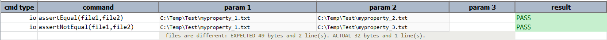

### Description
This command will assert if the contents of the files are identical.

### Parameters
- **file1** - This parameter is the full path along with file name.
- **file2**  - This parameter is the full path along with the file name.

### Example
**Script**: 

**Output**: 

### See Also
- [`assertNotEqual(file1,file2)`](assertNotEqual(file1,file2))
