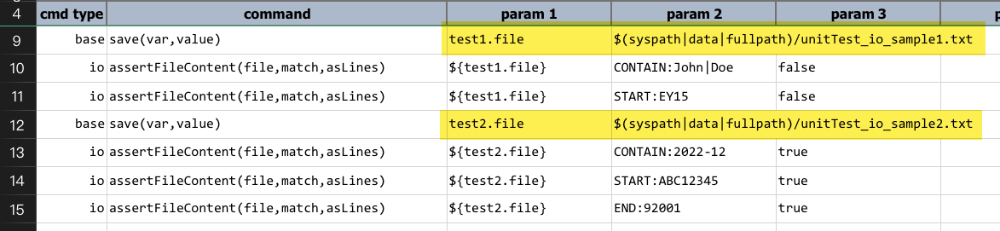
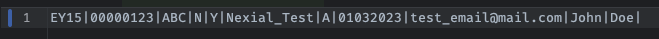
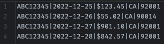
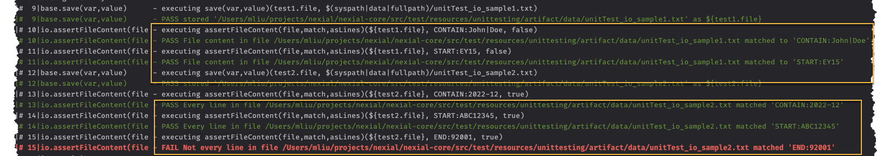

### Description
This command asserts that `file` is readable and contains text content that match the specified `match` parameter. The
`match` parameter can be expressed as plain text, which also means that the assertion in question is an "exact match"
test, or as a PolyMatcher for more flexible and expressive form of matching.



The third parameter instructs Nexial to either match the entire file content or to match line-by-line.

### Parameters
- **file** - the full path of the target file to check: (a) does the file exist? (b) is the file readable by the 
  run-user of the execution? (c) is it empty? Failure to any of these check would yield a `FAIL` outcome.
- **match** - the match to apply against the content of the `file`. PolyMatcher supported.
- **asLines** - `true` if the matching should be applied one line at a time, or `false` to match the entire file against
  the specified `match`. For line-by-line matching, every line must matched the specified `match` in order to be 
  considered a `PASS`.

### Example
Script: 

The content of `${test1.file}` (`unitTest_io_sample1.txt`): 

The script asserts against the first file in its entirety (`asLines` is `false`). Since the file contains `John|Doe` 
and starts with `EY15`, both line 10 and 11 resulted in `PASS` (below).

The content of `${test2.file}` (`unitTest_io_sample2.txt`): 

The script asserts against the second file in line-by-line mode (`asLines` is `true`). Line 13 and 14 results in `PASS`
because every line in this file contains `2022-12` and starts with `ABC12345`. However, since not every line ends with
`92001`, line 15 results in `FAIL`. See below for details.

**Output**: 
