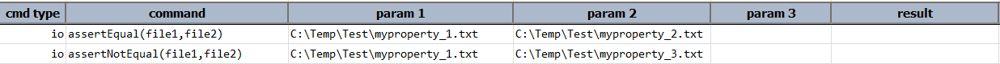

### Description
This command asserts if the contents of the files are not identical.  This is useful where negative assertion can help
ensure no duplicate contents between files.

### Parameters
- **file1** - This parameter is the full path along with file name.
- **file2**  - This parameter is the full path along with the file name.

### Example
**Script**: 

**Output**: 

### See Also
- [`assertEqual(file1,file2)`](assertEqual(file1,file2))
