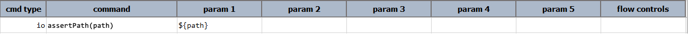
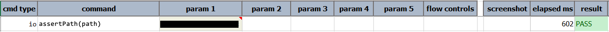

### Description
This command asserts that `path` exists and is readable by the run-user of the execution.

### Parameters
- **path** - the full path of the directory to check.

### Example
**Script**: 

**Output**: 

### See Also
- [`assertReadableFile(file,minByte)`](assertReadableFile(file,minByte))