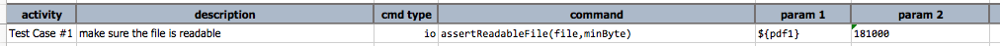
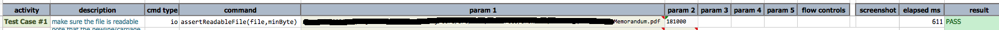

### Description
This command asserts that `file` is readable, and, optionally, at least `minByte` byte in size. To omit size 
checking, specified `(empty)`, `(blank)` or `-1` for `minByte`.

### Parameters
- **file** - the full path of the target file to check: (a) does the file exist? (b) is the file readable by the 
  run-user of the execution?
- **minByte** - the minimum number of bytes `file` should has. Use `(empty)`, `(blank)` or `-1` to omit checking 
  for file size.

### Example
Example: 

**Output**: 

