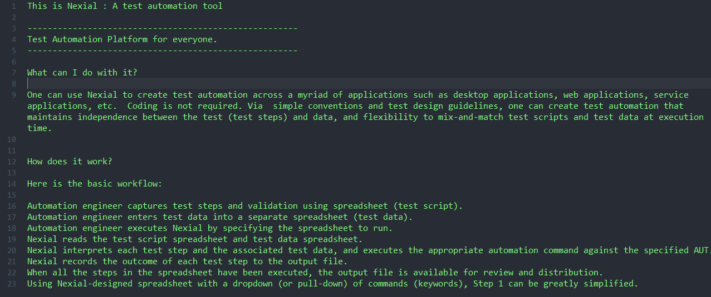
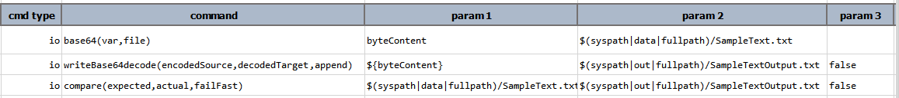
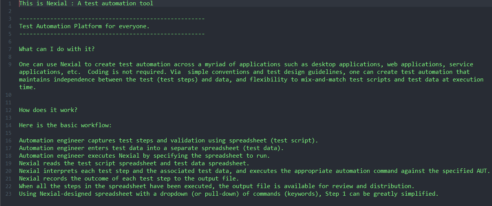

### Description
This command reads the content of `file` as byte array, then encodes it as in base64, and finally store the base64 
sequence a data variable (`var`). This command does not read the content of `file` as text. In fact any file will be 
read in the respective binary form, thus allowing the base64 encoding to be file-type independent.

### Parameters
- **var** - the variable to store the encoded base64 text
- **file** - the file from which to read and encode as base64 text

### Example
**SampleText.txt** 

**Script:**
- **Step 1**: Using this `base64(var,file)` command to encode the text file and store the resulting base64 sequence in 
  `byteContent`.
- **Step 2**: Using the [`writeBase64decode`](writeBase64decode(encodedSource,decodedTarget,append)) command to 
  decode the base64 sequence and write it to `SampleTextOutput.txt`.
- **Step 3**: Using the [`compare`](compare(expected,actual,failFast)) command to compare the source and output files. 

**Output:** 

**Comparison Result:** 
The source and output file are identical.

### See Also
- [`base64encode`](../../expressions/TEXTexpression)
- [`writeBase64decode(encodedSource,decodedTarget,append)`](writeBase64decode(encodedSource,decodedTarget,append))
