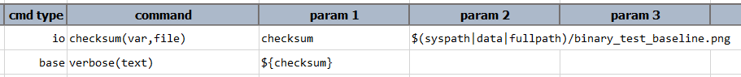

### Description
This command generates a checksum value for the given `file` and stores it into a data variable denoted by `var`. A 
<a href="https://en.wikipedia.org/wiki/Checksum" class="external-link" target="_nexial_external">checksum</a> is the 
numeric representation (aka _datum_) of a piece of digital data (in this case, a file). Its useful in terms of 
comparison to ensure digital authenticity and to guard against data corruption. It is also an effective strategy to 
uniquely track and identify a set of files based on their content.

Note that Nexial internally uses SHA-256 as the checksum algorithm.

### Parameters
- **var** - this parameter is a variable, where the checksum would be stored.
- **file** - this parameter is full path or location of the file from where checksum would be performed.

### Example
**Script**: 

### See Also
- [`base64(var,file)`](base64(var,file))
- [`writeBase64decode(encodedSource,decodedTarget,append)`](writeBase64decode(encodedSource,decodedTarget,append))
