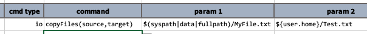
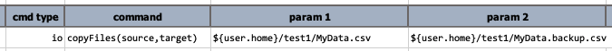
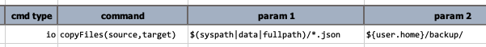
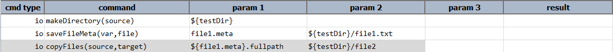
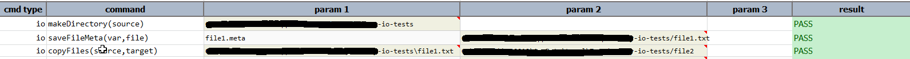

### Description
This command copies files from one location to other.



At its simplest form, one can use this command to copy a file to another location: 
 

Another use of this command is to copy the same file to the same location under a different name: 
 

One can also use this command to copy multiple files to another directory: 
 

Note that if the target location does not exist, Nexial will attempt to create it on the fly.

### Parameters
- **source** : Full path of the files to copy
- **target** : Full path of the destination

### Example
**Script**: 

**Output**: 

### See Also
- [`copyFilesByRegex(sourceDir,regex,target)`](copyFilesByRegex(sourceDir,regex,target))
- [`moveFiles(source,target)`](moveFiles(source,target))
- [`moveFilesByRegex(sourceDir,regex,target)`](moveFilesByRegex(sourceDir,regex,target))
- [`rename(target,newName)`](rename(target,newName))
