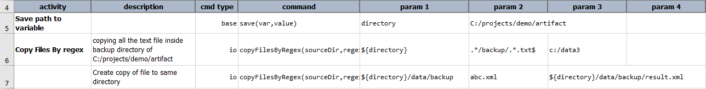
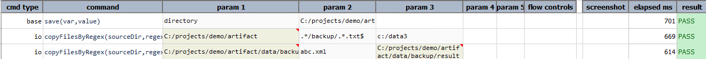

### Description
This command copies all files matching the specified regex from one directory to other. This will always search 
files recursively and copy matched files to given target location.



### Parameters
- **sourceDir** : Full path of the directory to match files from.
- **regex** : Regex to match with the file.
- **target** : Full path of the destination file/directory.

### Example
**Script**: 

**Output**: 

### See Also
- [`copyFilesByRegex(sourceDir,regex,target)`](copyFilesByRegex(sourceDir,regex,target))
