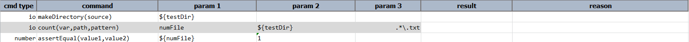
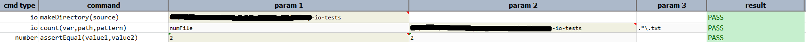

### Description
This command will count the number of files in particular folder.  The total count of the file are returned by the 
command.

### Parameters
- **var** - this parameter is the variable where total file count is found and stored
- **path** - this parameter is the full path of the directory under which all the desired files are located
- **pattern** - this parameter is the file type to be searched under the specific folder

### Example
**Script**: 

**Output**: 

### See Also
- [`makeDirectory(source)`](makeDirectory(source))
- [`readFile(var,file)`](readFile(var,file))
- [`writeFile(file,content,append)`](writeFile(file,content,append))
- [`copyFiles(source,target)`](copyFiles(source,target))
