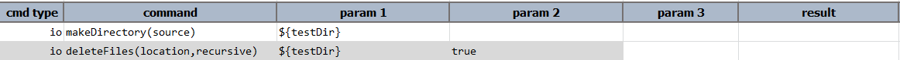
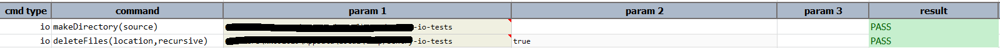

### Description
This command will be useful to delete files from specified location.The recursive can be set to true if there are 
recursive occurrence with the same file name.

### Parameters
- **location** - the full path of the folder/directory from where files need to be deleted
- **recursive** - `true` means to delete all the files and subdirectories of `location`

### Example
**Script**: 

**Output**: 

### See Also
- [`makeDirectory(source)`](makeDirectory(source))
- [`copyFiles(source,target)`](copyFiles(source,target))
- [`moveFiles(source,target)`](moveFiles(source,target))
