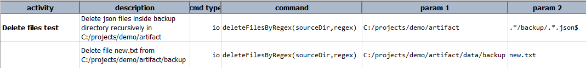
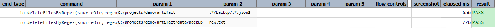

### Description
This command deletes all files matching the specified regex from specified source directory.  This will always 
search files recursively and delete matched files.

### Parameters
- **sourceDir** - Full path of the directory to match files from. Note this can't be file path.
- **regex** - Regex to match with the file.

### Example
**Script**: 

**Output**: 

### See Also
- [`deleteFiles(location,recursive)`](deleteFiles(location,recursive))
